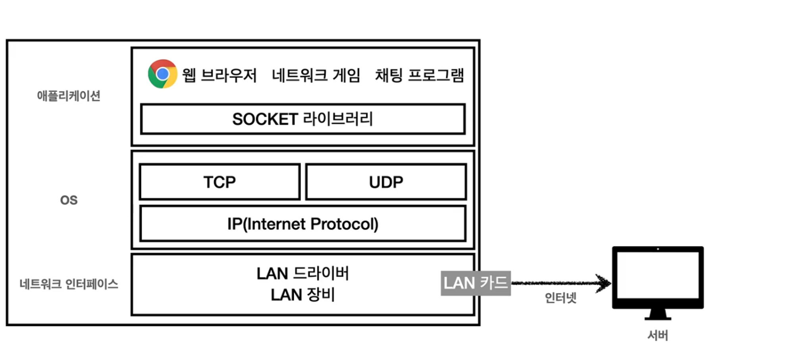
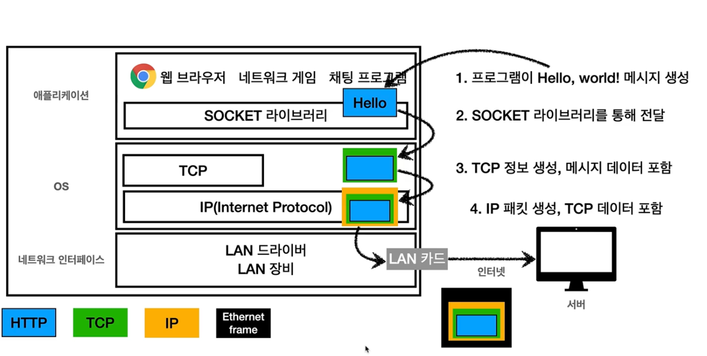
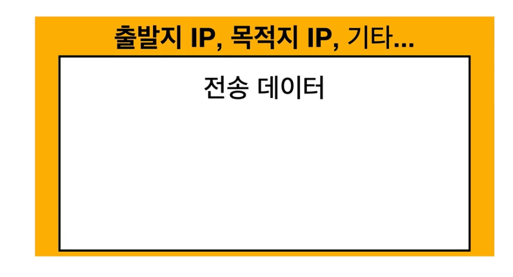
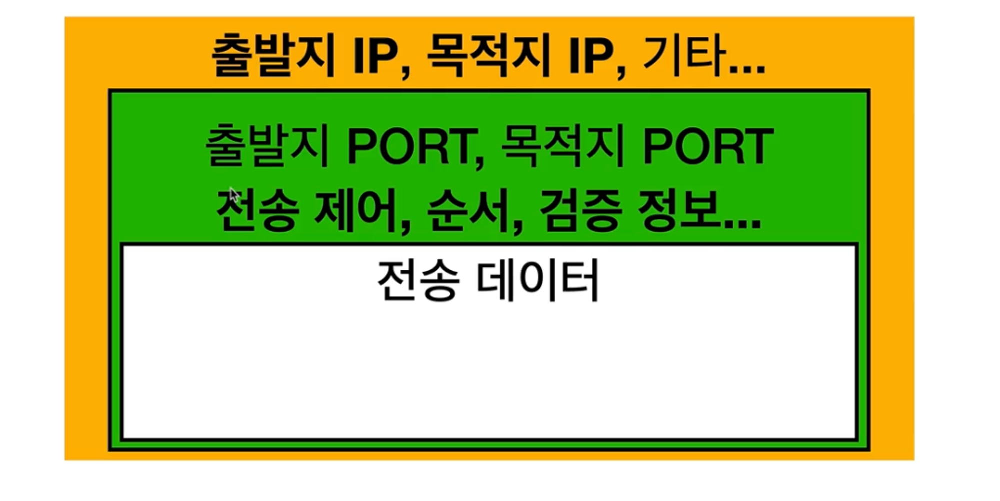
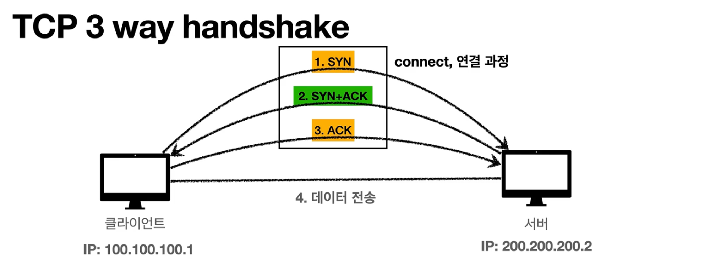
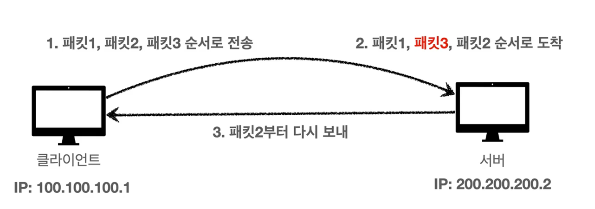

# TCP UDP

중간에 패키지자 손실이 되고 순서가 꼬이는 것을 TCP 프로토콜이 해결해준다.
UDP는 그런 걸 해결 해주지 않은데 도움이 되는 것이 있다.
인터넷 프로토콜 스택의 4계층
HTTP, FTP
TCP. UDP
IP
네트워크 인터페이스 계층 - 램 카드, cpu 같은거

ex) 미국에 있는 사람한테 채팅을 보낸다고 하면 소켓 라이브러리 통해서 os 계층에다가 hello 라는 메시지를 넘긴다.
그러면 TCP가 hello 라는 메시지에다가 tcp 정보를 쒸운다.
그 다음에 IP에 관련된 정보를 쒸운다.
그 다음에 랜 카드에 통해 Ethernet frame포함이 되서 나간다
맥 주소같은 물리적인 정보가 포함되어있다.
궁금하면 나중에 찾아보자.

## IP 패킷 정보

IP패킷 같은 경우 출발지 IP, 목적지 IP가 있다.
패킷이라는 것은 수화물을 뜻하는 패키지라는 것과 덩어리를 뜻하는 버킷이라는 것의 합성어이다.
택배 박스에 데이터를 넣어 보내는것과 비슷하다.

## TCP/IP 패킷 정보

IP 패킷에다가 TCP에 관련된 정보가 들어간다. 전송제어, 순서, 검증등등이 들어간다. 여기서 IP에서만 해결이 되지않은 부분이 해결이된다.

## TCP 특징

전송 제어 프로토콜

- 연결지향 - `TCP 3 way handshake(가상 연결)`
    - 연결이 됐나 안됐나 일단은 연결을 하고 메시지를 보낸다.
    - 컴퓨터가 꺼져 있으면 연결이 안된다.
- 데이터 전달 보증
    - 데이터를 전달 한것을 보증해준다.
    - 중간에 누락이 되면 내가 알 수 있다.
- 순서 보장
    - 순서를 보장해준다.

실제로는 더 많은 기능이 있다.

- 신뢰할 수 있는 프로토콜
- 현재는 대부분 TCP 사용

TCP IP 프로토콜로 뭔가 연결을 하면

1. `Synchronize(싱크로울나이츠)` 신이라는 메시지를 보낸다.
2. 그럼 서버에서 온 것을 알아서 엑크(ACK)메시지를 클라이언트에 보내면서 서버에도 연결해달라라고 보낸다.
3. 클라이언트가 ACK를 보낸다.

이런씩이면 클라이언트도 서버를 믿을 수 있고 서버도 클라이언트를 보낼 수 있다.
그래서 메시지를 SYN, SYN+ACK, SYN 이렇게 해서 세번 주고 받는다.
그러면 서로 연결이 되었는지 확인을한다.
연결이 되었는지 확인한 다음에 데이터를 전송한다.
만약에 서버가 꺼져있다고 치면 신 메시지를 보냈을 때 서버에서 응답이 없다. 응답이 없으면 메시지를 보내지 않는다.

요즘에는 최적화가 되서 3번 ACK를 보낼때 같이 데이터도 전송을 한다.
**`TCP 3 way handshake`는 진짜로 연결된게 아니다. 개념적으로만 연결이 된거다.**
논리적으로만 연결이 된거다. 중간에 수 많은 노드들이 있다. 그것들 까지는 우리는 모른다. 우리끼리만 연결이 된거구나 라고 생각하면된다.

## 데이터 전달 보증

데이터를 받으면 서버에서 "데이터를 잘 받았음"이라는 신호를 보내준다. 만약 아무 응답이 오지 않으면 문제가 있는걸로 판단

## 순서 보장

만약에 내가 packet을 1번, 2번, 3번 순서로 보냈다고 해보자.
그럼 서버가 만약에 1번, 3번, 2번 순으로 왔다고 해보자.
그러면 순서가 잘못되었다. 기본적으로는 그러면 다버리고 패킷2번 부터 다시보내라고 보낸다. 물론 서버에서 최적화를 할 수는 있다.
이게 어떻게 될까?

아까 `TCP/IP`사진을 다시 보면 전송제어, 순서 정보, 검증 정보들이 추가가 되어있어서 가능 하다.

## UDP 특징

`TCP`는 `UDP`랑 같은 계층에 있는 `IP`계층이다.
`UDP`는 기능이 없다.
`Thruwayy handshake` 없다.
데이터 전달을 보장해주지도 않는다.
순서를 보장해주지도 않는다.
우리가 배운 `IP`와 거의 똑같다. 그럼 뭐가 추가가 될까?
바로 포트가 추가가된다.

`포트`가 뭘까? 예를들어 내가 하나의 컴퓨터에서 음악 스트리밍도 하고 있고 게임도 하고 있다고 해보자.
그러면 여러 패키지가 온다. 그럼 내 PC에서는 어떤 씩으로 구분을 할까? 바로 그때 쓰는게 포트 입니다.

그리고 추가로 `체크섬` 정도만 추가된다.
`체크섬`은 이 메시지에 대해서 제대로 맞는지 검증해주는 데이터다.
`UDP`는의 장점은 매우 빠르다. `TCP`는 많은 기능이 있어서 느리다. 
`TCP`는 더이상 수정이 안된다. 더 최적화를 하고 싶으면 `UDP`를 쓰면된다.
한마디로 하얀 도화지이다. 최근에는 `UDP`가 뜨고 있다.