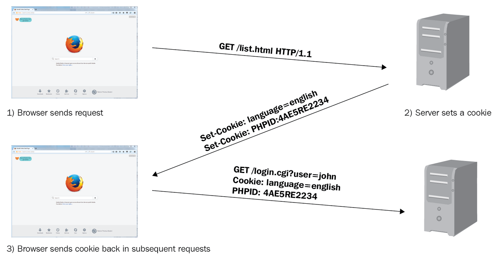
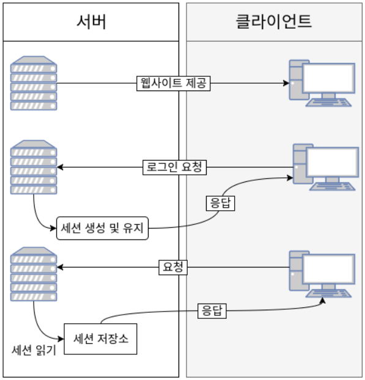

# 🦀 개요
`JWT + Spring Security + OAuth2.0`에 관한 책을 읽고 나서 `OAuth2.0`까지 챕터까지 완료 했다.
하지만 내가 쓴 코드지만 하나도 이해가 되지 않았다(그냥 따라치기만 한거 같다...). 머리속에 별로 남은것이 없다. 😂😂 그래서 책에서 하고 남은 코드를 이해 및 동작 방법에 대한 글을 쓰게 되었다.

# 🔒 Spring Security


먼저 시큐리티에 대해 알아보자!
- 간단히 말하면 스프링 기반의 보안을 담당하는 스프링 하위 프레임워크입니다. CSRF 공격, 세션 고정(session fixation) 공격을 방어 해주는 역할을 합니다. 

- 먼저 시큐리티에서 사용하는 용어를 알아봅시다!
- **인증 (Authentication)**
  사용자의 신원을 입증하는 과정입니다. 즉,사용자가 로그인을 할 때 누구인지 확인하는 과정

- **인가 (Authoriztion)**
  인가는 사이트의 특정 부분에 접근할 수 있는지 확인하는 작업입니다.
  예를 들어 쇼핑물 사이트에 "ADMIN", "MANAGER", "USER"라는 권한자들이 있다고 해보죠 "USER"의 권한을 가진 일반 사용자가 쇼핑물 관리 목록에 들어가서 A 품목의 가격을 낮춘다고 생각해봅시다.
  이러면 그 쇼핑물은 아무도 사용하지 않겠죠? 일반 사용자들은 관리자 페이지에 들어갈 수 없습니다. 이렇게 권한("ADMIN". "MANAGER")을 확인하는 과정을 **인가**라고 합니다.


## 🚰 시큐리티 필터

시큐리티는 필터 기반의 구조로 동작합니다.

| 이름                                       | 설명                                                                                                                                             |
| ---------------------------------------- | ---------------------------------------------------------------------------------------------------------------------------------------------- |
| SecurityContextPersistenceFilter         | SecurityContextRepository에서 SecurityContext(접근 주체와 인증에 대한 정보를 담고 있는 객체)를 가져오거나 저장하는 역할                                                         |
| LogoutFilter                             | 설정된 로그아웃 URL로 오는 요청을 확인해 해당 사용자를 로그아웃 처리                                                                                                       |
| **UsernamePasswordAuthenticationFIlter** | 인증 관리자, 폼 기반 로그인을 할 때 사용되는 필터로 아이디, 패스워드 데이터를 파싱해 인증 요청을 위임, 인증 성공시 AuthenticationSuccessHandler를, 실패 시 AuthenticationFailureHandler를 실행       |
| DefaultLoginPageGeneratingFilter         | 사용자가 로그인 페이지를 지정하지 않았을 때 기본으로 설정하는 로그인 페이지 관련 필터                                                                                               |
| BasicAuthenticationFilter                | 요청 헤더에 있는 아이디와 패스워드를 파싱해서 인증 요청을 위임합니다. 인증이 성공하면 AuthenticationSuccessHandler를, 인증에 실패하면 AuthenticationFailureHandler를 실행                      |
| RequestCacheAwareFilter                  | 로그인 성공 후, 관련 있는 캐시 요청이 있는지 확인하고 캐시 요청을 처리해줍니다. 예를 들어 로그인하지 않은 상태로 방문했던 페이지를 기억해두었다가 로그인 이후에 그페이지로 이동시켜줍니다.                                     |
| SecurityContextHolderAwareRequestFilter  | HttpServletRequest 정보를 감쌉니다. 필터 체인 상의 다음 필터들에게  부가 정보를 제공 하기 위해 사용합니다.                                                                         |
| AnonymousAuthentication                  | 필터가 호출되는 시점까지 인증되지 않았다면 익명 사용자 전용 객체인 AnoymousAuthentication을 만들어 SecurityContext에 넣어 줍니다.                                                     |
| SessionManagermentFilter                 | 인증된 사용자와 관련된 세견 관련 작업을 진행합니다. 세션 변조 방지 전략을 설정하고, 유효하지 않은 세션에 대한 처리를 하고, 세션 생성 전략을 세우는 등의 작업을 처리합니다.                                            |
| ExceptionTranslationFilter               | 요청에 처리하는 중에 발생할 수 있는 예외를 위임하거나 전달합니다.                                                                                                          |
| FilterSecurityInterceptor                | 접근 결정 관리자입니다. AccessDecisionManager로 권한 부여 처리를 위임함으로써 접근 제어 결정을 쉽게 해줍니다. 이 과정에서는 이미 사용자가 인증되어 있으므로 유효한 사용자인지도 알 수 있습니다. 즉, 인가 관련 설정을 할 수 있습니다. |
여기서 `UsernamePasswordAuthenticationFilter`는 Id, Password가 넘어오면 인증 요청을 위임하는 인증 관리자 역할을 한다.
그리고 `FilterSecurityInterceptor`는 권한 부여 처리를 위임해 접근 제어 결정을 쉽게 하는 접근 결정 관리자 역할을 합니다.

Filter는 Dispatcher Servlet으로 가기 전에 적용되므로 가장 먼저 URL 요청을 받지만, (웹 컨테이너에서 관리)  
Interceptor는 Dispatcher와 Controller 사이에 위치한다는 점에서 적용 시기의 차이가 있다. (스프링 컨테이너에서 관리)
> Client (request) → **Filter** → DispatcherServlet → **Interceptor** → Controller  
   (실제로 Interceptor가 Controller로 요청을 위임하는 것은 아님, Interceptor를 거쳐서 가는 것


## 스프링 시큐리티 인증 아키텍처


1. id, password 입력시,  HTTPServletRequest에 아이디와 비밀번호가 전달된다. 그리고 아이디와 비밀번호 정보가 전달된다. AuthenticationFilter가 넘어온 아이디와 비밀번호의 유효성 검사를 한다.
2. 유효성 검사가 끝나면 실체 구현체인 UsernamePasswordAythenticationToken을 만들어 넘겨준다.
3. 전달받은 인증용 객체인 UsernamePasswordAuthenticationToken을 AuthenticationManager(실제로 인증을 처리하는 AuthenticationProvider를 가지고 있음)에게 보낸다.
4. UsernamePasswordAuthenticationToken을 AuthenticationProvider에 보낸다.
5. AuthenticationProvider에에서 아이디 조회 후, 사용자 아이디를 UserDetailService에 보낸다. UserDetailService는 사용자 아이디로 찾은 사용자의 정보를 UserDetails 객체로 만들어 AuthenticationProvider에게 전달(UserDetailsService는 인터페이스이므로 상속받아 재정의한 클래스 작성 필요)
6. DB에 있는 사용자 정보를 가져온다.
7. 입력 정보와 UserDetails의 정보를 비교해 실제 인증 처리를 한다.
8. 10번 과정까지 인증이 완료되면 SecurityContextHolder에 Authentication을 저장한다. 인증 성공 여부에 따라 성공하면 AuthenticationSuccessHandler, 실패하면 AuthenticationFailureHandler 핸들러를 실행한다.
# 🔐 **Cookie / Session / Token** 인증 방식 종류
보통 서버가 클라이언트 인증을 확인하는 방식은 대표적으로 쿠키, 세션, 토큰 3가지 방식이 있다.

## 🍪 Cookie 인증
쿠키는 Key-Value 형식의 문자열 덩어리이다.
클라이언트가 어떠한 웹사이트를 방문할 경우, 그 사이트가 사용하고 있는 서버를 통해 클라이언트의 브라우저에 설치되는 작은 기록 정보 파일이다. 각 사용자마다 브라우저에 정보를 저장하니 고유 정보 식별이 가능한 것이다.


1. 브라우저가 서버에 요청을 보낸다.
2. 서버는 클라이언트의 요청에 대한 응답을 작성할 때, 클라이언트 측에 저장하고 싶은 정보를 응답 헤더의 Set-Cookie에 담는다.
3. 이후 해당 클라이언트는 요청을 보낼 때마다, 매번 저장된 쿠키를 요청 헤더의 Cookie에 담아 보낸다.
   서버는 쿠키에 담긴 정보를 바탕으로 해당 요청의 클라이언트가 누군지 식뵬하거나 정보를 바탕으로 추천 광고를 띄우거나 한다.

## 단점
- 보안에 취악, 요청 시 쿠키의 값을 그대로 보내기 때문에 유출 및 조작 당할 위험이 존재한다.
- 쿠키에는 용량 제한이 있어 많은 정보를 담을 수 없다.
- 웹 브라우저마다 쿠키에 대한 지원 형태가 다르기 때문에 브라우저간 공유가 불가능하다.
- 쿠키의 사이즈가 커질수록 네트워크에 부하가 심해진다.

## 🖥️ Session 인증
세션은 비밀번호 등 클라이언트의 민감한 인증 정보를 브라우저가 아닌 서버 측에 저장하고 관리한다. 서버의 메모리에 저장하기도 하고, 서버의 로컬 파일이나 데이터베이스에 저장하기도 한다.

> 세션 객체는 Key에 해당하는 SESSION ID와 이에 대응하는 Value로 구성되어 있다. Value에는 세션 생성 시간, 마지막 접근 시간 및 User가 저장된 속성 등 Map 형태로 저장된다.


1. 유저가 웹사이트에서 로그인을 하면 세션이 서버 메모리(혹은 DB) 상에 저장된다.
   세션을 식별하기 위한 Session Id를 기준으로 정보를 저장한다.
2. 서버에서 브라우저에 쿠키에다가 Session Id를 저장한다.
3. 쿠키에 정보가 담겨있기 때문에 브라우저는 해당 사이트에 대한 모든 Request에 Session Id를 쿠키에 담아 전송한다.
4. 서버는 클라이언트가 보낸 Session Id와 메모리로 관리하고 있는 Session Id를 비교하여 인증 수행한다.
## 단점
1. 쿠키를 포함한 요청이 외부에 노출 되더라도 세션 ID 자체는 유의미한 개인정보를 담고 있지 낳는다. 그러나 해커가 세션 ID 자체를 탈취하여 클라이언트인척 위장할 수 있다는 한계가 존재 한다.
2. 서버에서 세션 저장소를 사용하므로 요청이 많아지면 서버에 부하가 심해진다.
> 많은 트래픽 발생시 서버는 무상태(Statless)를 유지하는 것이 좋기 때문에(대체를 수월하기 때문) Session에다가 너무 많은 정보를 담으면 안된다.

## 🪙 Token 인증
토큰 기반 인증 시스템은 클라이언트가 서버에 접속을 하면 서버에게 해당 클라이언트에게 인증되었다는 의미로 '토큰'을 부여한다. 이 토큰은 유일하며 토큰을 발급받은 클라이언트 또 다시 서버에 요청을 보낼 때 요청 헤더에 토큰을 심어서 보낸다. 서버에서는 클라이언트로부터 받은 토큰을 서버에서 제공한 토큰과의 일치 여부를 체크하여 인증 과정을 처리하게 된다.

세션 인증 같은 경우는 서버의 메모리나 데이터베이스에 정보를 가지고 있어야 되지만 토큰은 세션과는 달리 서버가 아닌 클라이언트에 저장되기 된다. 토큰 자체에 데이터가 들어있기 때문에 클라이언트에서 받아 위조되었는지 판별만 하면 된다.

> 토큰 기반 인증은 같은 경우는 클라이언트에서 토큰을 가지고 있다가 로그인이 필요한 작업일 경우 헤더에 토큰을 함께 보내 인증받은 사용자인지 확인한다. 세션 기반 인증 시스템과 달리 상태를 유지하지 않기 때문에 Stateless(무상태)한 특징을 가지고 있다.

1. 사용자가 아이디와 비밀번호로 로그인을 한다.
2. 서버 측에서 사용자에게 유일한 토큰을 발급한다.
3. 클라이언트는 서버 측에서 전달받은 토큰을 쿠키나 스토리지에 저장해 두고, 서버에 요청을 할 때마다 해당 토큰을 HTTP 요청 헤더에 포함시켜 전달한다.
4. 서버는 전달받은 토큰을 검증하고 요청에 응답한다.

## 단점
1. 데이터의 길이가 길어, 인증 요청이 많아질수록 네트워크 부하가 심해질 수 있다.
2. Payload 자체는 암호화되지 않기 때문에 유저의 중요한 정보는 담을 수 없다.
3. 토큰을 탈취 당하면 대체하기 어렵다. (이를 방지하는 방법으로 사용 기간 제한을 설정하는 식으로 극복한다.)

# 🔒 JWT(JSON Web Token)


JWT이란 인증에 필요한 정보들을 암호화시킨 JSON 토큰을 의미한다. JWT 토큰을 HTTP 헤더에 실어 서버가 클라이언트를 식별한다.

JWT는 JSON 데이터를 Base64 URL-safe Encode를 통해 인토딩하여 직렬화한 것이다. 토큰 내부에서는 위변조 방지를 위해 개인키를 통한 전자서명도 들어가 있다.
사용자가 JWT를 서버로 전송하면 서버는 서명을 검증하는 과정을 거치게 되며 검증이 완료되면 요청한 응답을 돌려준다.


## Header
```json
{
	"alg": "HS256",
	"typ": "JWT"
}
```
alg : 서명 알고리즘 (RSA, HMAC SHA256)
typ : 토큰 유형


## Payload
```JSON
{ 
	"sub": "1234567890",
	"name": "John Doe",
	"admin": true 
}
```
토큰에서 사용할 정보(Claim)들이 들어가있다. (실제 JWT를 통해서 알 수 있는 데이터)

즉, 시스템에서 실제로 사용될 정보에 대한 내용
>key-value 형식으로 이루어진 한 쌍의 정보를 Claim이라고 칭한다.

페이로드에는 정해진 타입은 없지만, 대표적으로 Registered claims, Public claims, Private claims 이렇게 세 가지로 나뉜다.

Registered claims: 미리 정의된 클레임
- iss (issuer) : 토큰 발급자  
* sub (subject) : 토큰 제목 - 토큰에서 사용자에 대한 식별 값이 됨  
* aud (Audience) : 토큰 대상자  
* exp (Expiration Time) : 토큰 만료 기간  
* nbf (Not Before) : 토큰 활성 날짜 (이 날짜 이전의 토큰은 활성화되지 않음을 보장)  
* iat (Issued At) 토큰 발급 시간  
* jti (JWT id) : JWT 토큰 식별자 (issuer가 여러 명일 때 이를 구분하기 위한 값)
물론 이 전부를 구현하지 않아도 되지만 보안을 위해 권장을 한다.

Public claims: 사용자가 정의할 수 있는 클레임 공개용 정보 전달을 위해 사용.
Private claims: 해당하는 당사자들 간에 정보를 공유하기 위해 만들어진 사용자 지정 클레임. 외부에 공개되도 상관없지만 해당 유저를 특정할 수 있는 정보들을 담는다. (email 같은 것들)

## Signature
```java
HMACSHA256( 
	base64UrlEncode(header) + "." +
    base64UrlEncode(payload), 
    secret) // secret는 서버가 가지고 있는 키
```
시그니처에서 사용하는 알고리즘은 헤더에서 정의한 알고리즘 방식을 활용한다.
시그니처 구조는 (헤더 + 페이로드)와 서버가 갖고 있는 유일한 key 값을 합친 것을 헤더에서 정의한 알고리즘으로 암호화를 한다.

>Header와 Payload는 제 3자가 복호화 및 조작이 가능하지만, Signature는 서버측에서 관리하는 비밀키가 유출되지 않는 이상 복호화할 수 없다. 따라서 **Signature는 토큰의 위변조 여부를 확인하는데 사용된다.**

## 🔄 JWT를 이용한 인증과정

1. 사용자가 ID, PW를 입력하여 서버에 로그인 인증을 요청한다.
2. 서버에서 클라이언트로부터 인증 요청을 받으면 Header, PayLoad, Sinature를 정의한다.
   각각 Base64로 암호화하여 JWT를 생성하고 이를 쿠키에 담아 클라이언트에게 발급한다.
3. 클라이언트는 서버로부터 받은 JWT를 로컬 스토리지에 저장한다.(쿠키에도 저장 가능)
   로그인이 필요한 페이지에 접근시 Authorization header에 Access Tokenn을 담아서 보낸다.
4. 서버의 할 일은 클라이언트가 Header에 담아서 보낸 JWT가 서버에서 발행한 토큰인지 일치 여부를 확인하여 일치시 인증을 통과 시켜주고 아니라면 통과시키지 않으면 된다.
5. 클라이언트가 서버에 요청을 했는데, 만일 액섹스 토큰의 시간이 만료되면 클라이언트는 리프래시 토큰을 이용해서
6. 서버로부터 새로운 엑서스 토큰을 발급 받는다.

## 🦾 토큰 인증 신뢰성을 가지는 이유
JWT: A(Header) + B(Payload) + C(signature) 일때
1. 다른 사용자가 B를 임의로 수정
2. 수정한 토큰을 서버에 요청을 보내면 서버는 유효성을 검사 시행
   서버에서 검증 후 생성한 JWT: A + B + C => (signature) 불일치
3. 대조 결과가 일치하지 않아 유저의 정보가 임의로 조작되었음을 알 수 있다.

서버는 토큰 안에 있는 정보가 무엇인지 궁금하지 않다. 해당 토큰이 유효한 토큰인지 확인하는 것이 중요하다.
 클라이언트로부터 받은 JWT 헤더, 페이로드를 서버의 key값을 이용해 시그니처를 다시 만들고 이를 비교하며 일치했을 경우 인증을 통과시킨다.

> JWT은 서명(인증)이 목적이다.
> JWT는 Base64로 암호화를 하기 때문에 디버거를 사용해서 인코딩된 JWT를 1초만에 복호활 수 있다.
> 복호화 하면 사용자의 데이터를 담은 Payload 부분이 그대로 노출되어 버린다. 그래서 페이로드에는 비밀번호와 같은 민감한 정보를 넣지 말아야 한다.
> 그럼 토큰 인증 방식의 목적은 뭘까? **정보 보호의 목적이 아닌, 위조 방지이다.**
> 바로 위에서 소개햇듯이, 시그니처에 사용된 비밀키가 노출되지 않는이상 데이터를 위조해도 시그니처 부분에서 바로 걸러지기 때문이다.

## 🤗 JWT의 장단점 정리
장점: 인증을 위한 별도의 저장소가 필요없다. 별도의 I/O 작업 없는 빠른 인증 처리 확장성이 우수함
단점: 토큰의 길이가 늘어날수록 네트워크 부하 특정 토큰을 강제로 만료시키기 어려움

## JWT 장점
1. Header와 Payload를 가지고 Signature를 생성하므로 데이터 위변조를 막을 수 있다.
2. 인증 정보에 대한 별도의 저장소가 필요없다.
3. JWT는 토큰에 대한 기본 정보와 전달할 정보 및 토큰이 검증됬음을 증명하는 서명 등 필요한 모든 정보를 자체적으로 지니고 있다.
4. 클라이언트 인증 정보를 저장하는 세션과 다르게, 서버는 무상태(StateLess)가 되어 서버 확장성이 우수해질 수 있다.
5. 토큰 기반으로 다른 로그인 시스템에 접근 및 권한 공유가 가능하다.
6. OAuth2.0 같은 경우 소셜 계정을 이용하여 다른 웹서비스에서도 로그인을 할 수 있다.
7. 모바일 어플리케이션 환경에서도 잘 동작한다. (모바일은 세션 사용이 불가능하다.)


## JWT 단점
1. Self-contained: 토큰 자체에 정보를 담고 있으므로 양날의 검이 될 수 있다.
2. 토큰 길이: 토큰의 Payloaddp 3종류의 클레임을 저장하기 때문에, 정보가 많아질수록 토큰의 길이가 늘어나 네트워크에 부하를 줄 수 있다.
3. Payload 인코딩: payload 자체는 암호화 된 것이 아니라 BASE64로 인코딩 된 것이기 때문에, 중간에 Payload를 탈취하여 디코딩하면 데이터를 볼 수 있으므로, payload에 중요 데이터를 넣지 않아야 한다.
4. Store Token: stateless 특징을 가지기 때문에, 토큰은 클라이언트 측에서 관리하고 저장한다. 때문에 코튼 자체를 탈취당하면 대체하기가 어렵게 된다.

## 🔐 JWT의 Access Token / Refresh Token
이러한 단점 때문에, 그대로 사용하지 않고 Access Token, Refresh Token 으로 이중으로 나누어 인증을 하는 방식을 취한다.

- **Access Token** : **클라이언트**가 갖고있는 실제로 유저의 정보가 담긴 토큰으로, 클라이언트에서 요청이 오면 서버에서 해당 토큰에 있는 정보를 활용하여 사용자 정보에 맞게 응답을 진행
- **Refresh Token**: 새로운 Access Token을 발급해주기 위해 사용하는 토큰으로 짧은 수명을 가지는 Access Token에게 새로운 토큰을 발급해주기 위해 사용. 해당 토큰은 보통 **데이터베이스**에 유저 정보와 같이 기록.
# 🌐 OAuth2.0
.jpg)
## **OAuth 란?**
구글, 페이스북, X(전 트위터)와 같은 다양한 플랫폼을 특정한 사용자 데이터를 접근하기 위해 제 3자 클라이언트가 사용자의 접근 권한을 위임을 받을 수 있는 표준 프로토콜이다. 

## 🧩 구성 요소

### Resource Owner
우리의 서비스를 이용하면서, 구글, 페이스북 등의 플랫폼에서 리소스(개인정보)를 소유하고 있는 사용자이다. 
'Resource'는 개인정보라고 생각하면 된다.
### Client
Resource Server의 자원을 이용하고자 하는 서비스. 자사 또는 개인 만든 애플리케이션 서버이다.
### Authorization Server
사용자(Resource Owner)를 인증하고, Client는 이 서버에 Authorization Code를 넘겨 액세스 토큰을 발급을 받을 수 있다.
사용자(Resource Owner)는 이 서버로 ID, PW를 넘긴후 Authorization Code를 발급 받을 수 있다.
### Resource Server
**Resource Server**는 구글, 페이스북, 트위터와 같이 리소스를 가지고 있는 서버를 말한다.
Client는 Token을 이 서버로 넘겨 개인정보를 응답 받을 수 있다.
### Access Token
자원에 대한 접근 권한을 Resource Owner가 인가하였음을 나타내는 자격증명
### Refresh Token
Clien는 Authorization Server로 부터 access token(짧은 만료기간) refresh token(긴 만료기간)을 함께 부여받는다.
access token은 보안상 만료기간이 짧긴 때문에 기간이 지나면 사용자는 다시 로그인을 해줘야 한다. 그러므로 만료기간이 지나면 refresh token을 통해 access token을 다시 재발급 받는다.

## Google로 간단히 알아보기
Google API Console에 들어가서 callbackURL 및 구글로 요청 정보(scope) 설정해야 되는데 구글 같은 경우는 기본적으로 Scope이 정해져 있다.
네이버 또는 카카오 같은 OAuth에 기본적으로 등록되어 있지 않은 것들은 따로 scope을 정해줘야 한다.

**네이버 scope**

<cite>https://juheeexx.tistory.com/10</cite>

**구글 scope**(Spring 환경)
```java
public enum CommonOAuth2Provider {  
    GOOGLE {  
        public ClientRegistration.Builder getBuilder(String registrationId) {  
            ClientRegistration.Builder builder = this.getBuilder(registrationId, ClientAuthenticationMethod.CLIENT_SECRET_BASIC, "{baseUrl}/{action}/oauth2/code/{registrationId}");  
            builder.scope(new String[]{"openid", "profile", "email"});  
            builder.authorizationUri("https://accounts.google.com/o/oauth2/v2/auth");  
            builder.tokenUri("https://www.googleapis.com/oauth2/v4/token");  
            builder.jwkSetUri("https://www.googleapis.com/oauth2/v3/certs");  
            builder.issuerUri("https://accounts.google.com");  
            builder.userInfoUri("https://www.googleapis.com/oauth2/v3/userinfo");  
            builder.userNameAttributeName("sub");  
            builder.clientName("Google");  
            return builder;  
        }  
    },
    // ....
}
```
Spring환경에서 CommonOAuth2Provider을 보면 `builder.scope(new String[]{"openid", "profile", "email"});`을 보면 scope가 `openid`, `profile`, `email`이 정해져있다.
<p align="center">
	
	<cite>https://theonetechnologies.com/blog/post/how-to-get-google-app-client-id-and-client-secret</cite>
</p>
4번을 보면 **callbackURL**을 설정해준다.
등록이 완료되면 클라이언트 아이디와 비번 정보가 나온다.
<p align="center"> 
	 
	<cite>https://theonetechnologies.com/blog/post/how-to-get-google-app-client-id-and-client-secret</cite>
</p>
Clien ID, Clien Secret, Authorized redirect URLs는 서비스를 등록하면 받게되는 필수 요소는 다음과 같다.

```text
Createp app
-------------------------------------
Clien ID      1
Clien Secret  2

Authorized redirect URLs https://clien/callback
```
**Clien ID**
- 어플리케이션을 식별하는 식별자 ID를 의미
- Resource Server 입장에서는 어떤 서비스에게 제공할 것 인지 구분하는 ID를 의미한다.

**Clien Secret**
- ID의 패스워드라고 하면 편하다.
- Client ID에 대한 비밀번호 ID같은 경우는 외부에 노출되도 상관없지만 Secret같은 경우는 외부에 절대 노출되면 안된다.

**Authorized redirect URLs**
- Resource Server만 갖는 정보로,  client에 권한을 부여하는 과정에서 나중에 Authorized code를 전달하는 통로다.
- 나중에 client <-> Resource Server 유효성 검사에서 이 redirect URIs도 체크되며 해당주소가 아닐 경우 Resource Server는 해당 client가 아니라고 판단한다.
- 참고로 redirect URL은 https이어야 한다. (localhost 같은 경우는 예외)

**scope**
- Resource Server에서 사전에 사용 가능하도록 미리 정의한 기능

## Resource owner 승인 과정

`1.` 사용자(Resource owner)는 서비스(client)를 이용하기 위해 로그인 페이지에 접근한다.
`2.` 그럼 서비스(client)는 사용자(Resource Owner)에게 로그인 페이지를 제공하게 된다.
<p align="center">
	
</p>

`3.` 사용자가 소셜 로그인 버튼을 누르면, 해당(Google, Meta) 서버로 특정 url 보내지게 된다.
   
>등록을 하게 되면 Client(내 서비스)와 Resource Server(Google 서버)에 Client id, Client Secret은 둘이 서로 알고 있는 상황

   특정 url 같은 경우는 다음과 비슷하게 생겼다.
```BASH
https://resource.server/?client_id=1&scope=B,C&redirect=https://client/callback
```
위의 코드가 어떻게 구성되어 있는지 확인해보자.
```
https://resource.server/? # 1
client_id=1 # 2
&scope=B,C # 3
&redirect=https://client/callback # 4
```
- 리소스 서버(Google, Naver, Kakao..)
- 어떤 client인지를 id를 통해 Resouce Owner에게 알려주는 부분
- Resource Owner가 사용하려는 기능, 다르게 말하면 client가 자신 서비스에서 사용하려는 Resource Server 기능을 표현한다.
- 개발자 홈페이지에 서비스 개발자 입력한 응답 콜백
향후 **redirect_uri 경로를 통해서 Resource Server는 client에게 임시비밀번호인 Authorization code를 제공**한다.

`4.` 클라이언트로부터 보낸 정보와, 리소스 로그인 서버에 등록된 서비스 정보를 비교한다.
`4.1 `확인 완료되면, Resource Server로 부터 전용 로그인 페이지로 이동하여 사용자에게 보여준다.
`5.` ID/PW를 적어서 로그인을 하게되면, client가 사용하려는 기능(scope)에 대해 Resource Owner의 동의(승인)을 요청한다. 
   

`5.1` Resource Owner가 Allow 버튼을 누르면 Resource Owner가 권한을 위임했다는 승인이 Resource Server 에 전달된다. 
   
   
   리소스 서버가 가지는 정보는 다음과 같다.
   - Client id: Resource Owner와 연결된 client가 누군지
   - Client Secret: Resource Owner와 연결된 client의 비밀번호
   - Redirect URL: client와 통신할 통로
   - user id: client와 연결된 Resource Owner의 id
   - scope: client가 Resource Owner 대신에 사용할 기능들
`6.` 하지만, 이미 Owner가 Client에게 권한 승인을 했더라도 아직 Server가 허락하지 않았다. 따라서, Resource Server 도 Client에게 권한 승인을 하기위해 Authorization code를 Redirect URL을 통해 사용자에게 응답하고
`7.` 다시 사용자는 그대로 Client에게 다시 보낸다.
   
이를 통해, client는 Resource Server가 보낸 Authorization code, "code=3"를 Resource Owner통해 받는다.
`8.` 이제 Client가 Resource Server에게 직접 url(클라이언드 아이디, 비번, 인증코드 ...등)을 보낸다. 

`9. `그럼 Resource Server는 Client가 전달한 정보들을 비교해서 일치한다면, Access Token을 발급한다. 그리고 이제 필요없어진 **Authorization code는 지운다.**
`10.` 그렇게 토큰을 받은 Client는 사용자에게 최종적으로 로그인이 완료되었다고 응답한다.
`11 ~ 14.` 이제 client는 Resource server의 api를 요청해 Resource Owner의 ID 혹은 프로필 정보를 사용할 수 있다.

`15.` Access Token이 기간이 만료되어 401에러가 나면, Refresh Token을 통해  Access Token을 재발급 한다.


참고
https://dev-coco.tistory.com/174</br>
https://inpa.tistory.com/entry/WEB-%F0%9F%93%9A-JWTjson-web-token-%EB%9E%80-%F0%9F%92%AF-%EC%A0%95%EB%A6%AC</br>
https://inpa.tistory.com/entry/WEB-%F0%9F%93%9A-OAuth-20-%EA%B0%9C%EB%85%90-%F0%9F%92%AF-%EC%A0%95%EB%A6%AC</br>
https://hudi.blog/oauth-2.0/ </br>
https://www.youtube.com/watch?v=UH5XnjkBqKE&list=PLuHgQVnccGMA4guyznDlykFJh28_R08Q-&index=4</br>
https://hwannny.tistory.com/92