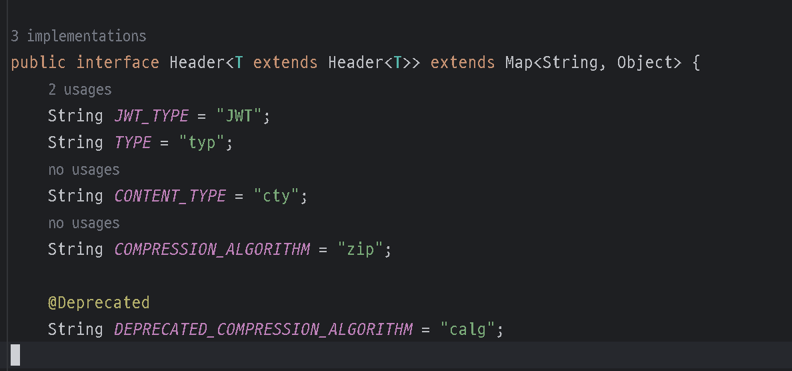

# ⏸️ 들어가기 앞서

전 글 : 블로그 - [JWT + Spring Security + OAuth2.0 (1)](https://velog.io/@tkdgml82/JWT-Spring-Security-OAuth2.0-1-5atjok39) 깃 - [JWT + Spring Security + OAuth2.0 (1)](https://github.com/tkdgml822/Obsidian_Study/blob/main/JWT%20%2B%20Spring%20Security%20%2B%20OAuth2.0/JWT%20%2B%20Spring%20Security%20%2B%20OAuth2.0%20(1).md)

코드를 설명하기 전에 제가 진행한 프로젝트는 `thyleaf` 및 `dto` 은 자세히 설명하지 않겠습니다. JWT 및 OAuth2.0에서 주요 코드들만 설명을 하도록 하겠습니다

## JwtProperties

```java
@Setter
@Getter
@Component
@ConfigurationProperties("jwt") // 자바 클래스에 프로퍼티값을 가져와서 사용하는 애너테이션
public class JwtProperties {
    private String issuer;
    private String secretKey;
}

```

먼저 앞서 jwt에 Payload에는 7가 정도의 Regustered claims(미리 정의된 클레임)들이 있습니다.

- **iss (issuer) : 토큰 발급자**
- sub (subject) : 토큰 제목 - 토큰에서 사용자에 대한 식별 값이 됨
- aud (Audience) : 토큰 대상자
- exp (Expiration Time) : 토큰 만료 기간
- nbf (Not Before) : 토큰 활성 날짜 (이 날짜 이전의 토큰은 활성화되지 않음을 보장)
- iat (Issued At) 토큰 발급 시간
- jti (JWT id) : JWT 토큰 식별자 (issuer가 여러 명일 때 이를 구분하기 위한 값)

이 `JwtProperties` 같은 경우는 `iss : 토큰 발급자`와 Signature에

```java
HMACSHA256(
	base64UrlEncode(header) + "." +
    base64UrlEncode(payload),
    secret) // secret는 서버가 가지고 있는 키

```

secret를 담는 클래스입니다. 그럼 이 값은 어디서 올까요? 이 값들은

```
application.yml
```

에서 옵니다.


오는 곳은 알았으니 어떻게 값들을 넣었을까요?

- `@ConfigurationProperties("jwt")`: configuration 과 몇몇 속성을 .properties 혹은 .yaml 에서 쉽게 가져오는 방법을 제공 예를 들어 application.yml 있다면

```
mail:
 hostname: host@mail.com
 port: 9000
 from: mailer@mail.com

```

다음과 같이 사용하게 된다.

```java
@Configuration
@ConfigurationProperties(prefix = "mail")
public class ConfigProperties {
	private String hostName;
	private int port;
	private String from;
}

```

> 다른 방식도 있긴하다. 예를 들어 @Value를 사용하는 방식도 선택할 수 있을것이다. @Value은 @ConfigurationProperties("mail")와 비슷하지만 사용 방법이 다르다. @ConfigurationProperties같은 경우는 매핑을 자동으로 해주지만 @Value을 쓰면 필드에다가 하나씩 매핑을 해줘야 한다. @Value("#{mail.hostnName}) 이런씩으로 해준뒤 ConfigProperties 클래스 hostName에 붙여야 한다. port 매핑할려면 @Value("#{mail.port}")을 port에 붙여야 한다.

간단히 말하면 `@ConfigurationProperties`을 쓰면 `.yaml`에다가 쉽게 매핑이 된다.

## TokenProvider

클래스 이름대로 토큰을 제공해주는 클래스이다.

```java
@RequiredArgsConstructor
@Service
public class TokenProvider {

    private final JwtProperties jwtProperties;

    public String generateToken(User user, Duration expiredAt) {
        Date now = new Date();
        return makeToken(new Date(now.getTime() + expiredAt.toMillis()) , user);
    }

	// 1. JWT 토큰 생성 메서드
    private String makeToken(Date expiry, User user) {
        Date now = new Date();

        return Jwts.builder()
                .setHeaderParam(Header.TYPE, Header.JWT_TYPE)
				.setIssuer(jwtProperties.getIssuer())
                .setIssuedAt(now)
                .setExpiration(expiry)
                .setSubject(user.getEmail())용자에 대한 식별 값
                .claim("id", user.getId())이다.
                .signWith(SignatureAlgorithm.HS256, jwtProperties.getSecretKey())
                .compact();
    }

    // 2. JWT 토큰 유효성 검증 메서드
    public boolean validToken(String token) {
		try {
            Jwts.parser()
                    .setSigningKey(jwtProperties.getSecretKey())
                    .parseClaimsJws(token);

            return true;
        } catch (Exception e) { // 복호화 과정에서 에러가 나면 유효하지 않은 토큰
            return false;
        }
    }

    // 3. 토큰 기반으로 인증 정보를 가져오는 메서드
    public Authentication getAuthentication(String token) {
        Claims claims = getClaims(token);
        Set<SimpleGrantedAuthority> authorities = Collections.singleton(new SimpleGrantedAuthority("ROLE_USER"));

        return new UsernamePasswordAuthenticationToken(new org.springframework.security.core.userdetails.User(
                claims.getSubject(), "", authorities), token, authorities);

    }

    // 4. 토큰 기반으로 유저 ID를 가져오는 메서드
    public Long getUserId(String token) {
        Claims claims = getClaims(token);
        return claims.get("id", Long.class);
    }

    private Claims getClaims(String token) {
        return Jwts.parser() // 클레임 조회
                .setSigningKey(jwtProperties.getSecretKey())
                .parseClaimsJws(token)
                .getBody();
    }

}

```

### `generateToken(User user, Duration expiredAt)`

```java
public String generateToken(User user, Duration expiredAt) {
    Date now = new Date();
    return makeToken(new Date(now.getTime() + expiredAt.toMillis()) , user);
}

```

`Date now = new Date();` : Date를 써서 현재 시간을 가져온다. `return makeToken(new Date(now.getTime() + expiredAt.toMillis()) , user);`: makeToken은 토큰을 만들어주는 메서드이다. 메서드에 현재 날짜와 Duration클래스를 사용해서 밀리초를 넣어준다. 그리고 마지막에는 user의 정보를 넣어준다. user 클래스는 추후 설명하겠다.

> Duration에 관해서 잘 모르는 분들을 위한 제가 참고 한 블로그 입니다. [Java8 Time API] Duration과 Period 사용법 (+ChronoUnit)

- `makeToken()` JWT 토큰 생성하는 메서드입니다. 첫 줄 `Date now = new Date();` 보면 현재 생성한 날짜를 생성합니다. 그리고 `Jwts.builder()`로 Jwt을 토큰을 생성합니다.z
    - `setHeaderParam(Header.TYPE, Header.JWT_TYPE);` : 먼저 JWT에서 Header 부분을 정하는 메서드입니다. `Header.TYPE` `"typ"`이며 `Header.JWT_TYPE`는 `"JWT"` 입니다. `Header`는 인터페이스이며 미리 정의되어 있는 인터페이스입니다.



- `setIssuer(jwtProperties.getIssuer())`: 이 메소드 같은 경우는 발급자를 정해줍니다. `jwtProperties`에 `issuer`, `serectKey`가 있는데 거기서 `issuer`을 가져와서 `iss`을 정해줍니다.
- `setIssuedAt(now)`: 토근 발급 시간입니다. 현재 시간을 가져와서 발급 시간을 정해줍니다.
- `setExpiration(expiry)`: 토큰 만료 기간입니다. `현재 시간 + 정해둔 만료기간`으로 만료기간이 정해집니다.
- `setSubjet(user.getEmail())`: 토큰 제목 - 토큰에서 사용자에 대한 식별 값이 됩니다. 여기서는 유저의 이메일로 식별합니다.
- `claim("id", user.getId())`: 클레임에 사용자 Id를 추가 합니다.
- `signWith(SignatureAlgorithm.HS256, jwtProperties.getSecretKey())`: 서명 과정입니다. 암호화 알고리즘으로는 HS256을 쓰면 암호화를 할때 미리 지정한 SecretKey로 사용해서 서명을 하겠다는 뜻입니다.

### `validToken(String token)`

```java
public boolean validToken(String token) {
    try {
        Jwts.parser()
			.setSigningKey(jwtProperties.getSecretKey())
			.parseClaimsJws(token);

        return true;
    } catch (Exception e) {
        return false;
    }
}

```

이 메소드는 토큰 유효성을 검증하는 메서드입니다. 유효성을 검증을 하면 true를 반환하고 아닌 경우 false를 반환합니다. 중간에 토큰 값이 다르면 `Exception` 오류가 납니다.

- `Jwts.parser()`: JwtParser객체를 생성합니다. JwtParser은 서명을 검증 및 페이로드에 담긴 클레임을 추출하는데 사용합니다.
- `.setSigningKey(jwtProperties.getSecretKey())`: 서명을 검증하기 위해 비밀키를 설정합니다.
- `.parseClaimsJws(token)`: 전달 받은 Jwt 토큰을 파싱합니다. 토큰의 서명을 검증 한 후, 토큰의 페이로드에 담긴 클레임을 추출합니다.

### `getAuthentication(String token)`

```java
public Authentication getAuthentication(String token) {
    Claims claims = getClaims(token);
    Set<SimpleGrantedAuthority> authorities = Collections.singleton(new SimpleGrantedAuthority("ROLE_USER"));

    return new UsernamePasswordAuthenticationToken(new org.springframework.security.core.userdetails.User(
            claims.getSubject(), "", authorities), token, authorities);

}

```

토큰 기반으로 인증 정보를 가져오는 메서드 입니다. 이 메서드의 반환 타입은 `Authentication`입니다.

> Authentication이란? 사용자의 인증 정보를 나태내는 인터페이스이다. 인증 시 id와 password 를 담고 인증 검증을 위해 전달되어 사용 되며, 인증이 성공하면 사용자는 시스템에 대한 액세스 권한을 부여받고 SecurityContext에 저장되어 전역적으로 참조가 가능하다.

> Authentication의 구조 principal : 사용자 아이디 혹은 User 객체를 저장
> 
> credentials : 사용자 비밀번호 authorities : 인증된 사용자의 권한 목록
> 
> details : 인증 부가 정보
> 
> Authenticated : 인증 여부

그리고 `getClaims()`메서드는 넘겨준 token으로 페이로드(Payload)부분에 있는 클레임(Claims)들을 반환합니다. `SimpleGrantedAuthority`을 사용해서 `ROLE_USER`권한을 만들어 준뒤 Collection.singleton에다가 넣어줍니다.

> Collections.singleton이란?Collections.singleton에 대해 간단히 얘기하면 불변성을 유지합니다. 좀더 자세한 이야기는 제 블로그에 있는 글을 참고 해주시면 감사합니다. Collections.singleton에 관하여

> SimpleGrantedAuthority이란? 문자열을 생성자 파라미터에 넣는주는 것만으로 권한 객체 생성을 할 수 있게 해준다. 이름 그대로 간단하게 권한을 설정해준다.

그리고 마지막 코드줄을 보면 `UsernamePasswordAuthenticationToken`을 반환하는데`UsernamePasswordAuthenticationToken`을 간단히 말하면 사용자가 폼 로그인 시`AuthenticationFilter`가 `UsernamePasswordAuthenticationToken`의 인증용 객체를 만들어주는데 추후 `ProviderManager`에게 `UserNamePasswordToken` 객체를 전달하는 역할을 하는데 그런 다음 추후 인증을 완전히 마치게 되면 `SecurityContextHolder`에 넣어줍니다.


참고로 `SecurityContextHolder`에는 `Authentication`가 들어가는데`UsernamePasswordAuthenticationToken` 같은 경우는 `Authentication`의 자식입니다.

```java
public class UsernamePasswordAuthenticationToken extends AbstractAuthenticationToken {
	// ....
}
```

`UsernamePasswordAuthenticationToken`은 `AbstractAuthenticationToken`을 상속받았다.

```java
public abstract class AbstractAuthenticationToken implements Authentication, CredentialsContainer {
	// ....
}
```
`AbstractAuthenticationToken`같은 경우는 `Authentication`을 상속받았다. 그러므로 `SecurityContext`에 들어갈 수 있다.

`UsernamePasswordAuthenticationToken` <- `AbstractAuthenticationToken` <- `Authentication`, `CredentialsContainer

`UsernamePasswordAuthenticationToken` 첫번째는 사용자 아이디 혹은 User 객체를 넣는데 `new org.springframework.security.core.userdetails.User()`이라고 스프링 시큐리티에서 제공해주는 `User` 객체를 사용한다. User의 객체에는 username, password, authorities을 넣어주는데 getSubject로 이메일을 넣어준고 비밀번호는 빈 문자열을 넣어줍니다. 그리고 위에서 생성한. ROLE_USER을 정보를 가진 유저를 넣어줍니다.

> 비밀번호는 빈 문자열인 이유는 JWT 토큰 기반 인증에서는 비밀번호가 필요하지 않기 때문입니다.

그런 다음 `UsernamePasswordAuthenticationToken`에 token과 권한을 넣어줍니다..

### `getUserId(String token)`

```java
public Long getUserId(String token) {
    Claims claims = getClaims(token);
    return claims.get("id", Long.class);
}

```

해당 메서드는 토큰 기반으로 유저 ID를 가져오는 메서드입니다. 토큰으로 클레임을 가져와서 복호화를 해준뒤 거기서 id를 가져옵니다

### `getClaims(String token)`

```java
private Claims getClaims(String token) {
    return Jwts.parser() // 클레임 조회
            .setSigningKey(jwtProperties.getSecretKey())
            .parseClaimsJws(token)
            .getBody();
}

```

클레임을 조회하는 메서드입니다. `SecretKey`으로 복호화를 한뒤 토큰을 검증해줍니다. `Payload` 클레임들을 가져옵니다. 현재 이 메서드 같은 경우는 `getUserId()`와 `getAuthentication()`에서 사용중입니다.

## TokenAuthenticationFilter

다음은 토큰인증 필터 입니다.

```java
@Slf4j
@RequiredArgsConstructor
public class TokenAuthenticationFilter extends OncePerRequestFilter {

    private final TokenProvider tokenProvider;
    private final static String HEADER_AUTHORIZATION = "Authorization";
    private final static String TOKEN_PREFIX = "Bearer ";

    @Override
    protected void doFilterInternal(HttpServletRequest request, HttpServletResponse response, FilterChain filterChain) throws ServletException, IOException {
        // 요청 헤더의 Authorization 키의 값 조회
        String authorizationHeader = request.getHeader(HEADER_AUTHORIZATION);
        // 가져온 값에서 접두사 제거
        String token = getAccessToken(authorizationHeader);

        // 가져온 토큰이 유효한지 확인하고, 유효한 때는 인증 정보 설정
        if (tokenProvider.validToken(token)) {
            Authentication authentication = tokenProvider.getAuthentication(token);
            SecurityContextHolder.getContext().setAuthentication(authentication);
        }

        filterChain.doFilter(request, response);
    }

    private String getAccessToken(String authorizationHeader) {
        if (authorizationHeader != null && authorizationHeader.startsWith(TOKEN_PREFIX)) {
            return authorizationHeader.substring(TOKEN_PREFIX.length());
        }
        return null;
    }
}

```

현재 이 클래스는 `OncePerRequestFilter`상속 받았는데 `OncePerRequestFilter`같은 경우는 이름에서 알 수 있듯 `Http Request`의 한 번의 요청에대해 한 번만 실행하는 `Filter`입니다.

`OncePerRequestFilter`을 사용하는 이유는 서블릿은 요청마다 서블릿을 생성하여 메모리에 저장한 뒤 같은 클라이언트의 요청이 들어올 경우 생성해둔 서블릿 객체를 재활용합니다.

그런데 만약 서블릿이 다른 서블릿으로 dispatch하게 되면, 다른 서블릿 앞단에서 filter chain을 한번 더 거치게 된다. 그것을 막기 위해 `OncePerRequestFilter`을 사용합니다.

**필드**

```java
private final TokenProvider tokenProvider;
private final static String HEADER_AUTHORIZATION = "Authorization";
private final static String TOKEN_PREFIX = "Bearer ";

```

- `TokenProvider` 좀 전에 설명한 `TokenProvider`입니다. `@RequiredArgsConstructor`을 사용해서 DI 주입을 자동을 설정했습니다.
- `HEADER_AUTHORIZATION` HTTP Header에 token을 보낼때 key, value에서 key로 설정할 문자열입니다.
- `TOKEN_PREFIX` HTTP Header에서 token을 보낼때 `"Bearer " + token`형식으로 보냅니다.

### `doFilterInternal()`

```java
@Override
protected void doFilterInternal(HttpServletRequest request, HttpServletResponse response, FilterChain filterChain) throws ServletException, IOException {
    // 요청 헤더의 Authorization 키의 값 조회
    String authorizationHeader = request.getHeader(HEADER_AUTHORIZATION);
    // 가져온 값에서 접두사 제거
    String token = getAccessToken(authorizationHeader);

    // 가져온 토큰이 유효한지 확인하고, 유효한 때는 인증 정보 설정
    if (tokenProvider.validToken(token)) {
        Authentication authentication = tokenProvider.getAuthentication(token);
        SecurityContextHolder.getContext().setAuthentication(authentication);
    }

    filterChain.doFilter(request, response);
}

```

- `request.getHeader(HEADER_AUTHORIZATION)`: 클라이언트가 보낸 Header에서 Authorization 헤더 값을 가져온다.
- `getAccessToken(authorizationHeader)`: 가져온 토큰에는 "Bearer " 가 붙어 있기 때문에 제거 해줍니다.
- `if (tokenProvider.validToken(token))`: 토큰이 유효한지 확인합니다.
- `Authentication authentication = tokenProvider.getAuthentication(token)`: 토큰이 유효한것을 확인했으니 그 토큰의 인증 정보를 가져옵니다.
- `SecurityContextHolder.getContext().setAuthentication(authentication)`: 그 다음에 `SecurityContextHolder`에 인증정보(authentication)를 넣습니다.
- `filterChain.doFilter(request, response)`: 요청 응답을 다음 필터로 전달합니다.

### `getAccessToken()`

Header에서 Authorization를 가져온뒤 `"Bearer "` 문자열을 제거해준 뒤 토큰값만 반환하는 메서드입니다.

```java
private String getAccessToken(String authorizationHeader) {
    if (authorizationHeader != null && authorizationHeader.startsWith(TOKEN_PREFIX)) {
        return authorizationHeader.substring(TOKEN_PREFIX.length());
    }
    return null;

```

- `if (authorizationHeader != null && authorizationHeader.startsWith(TOKEN_PREFIX))`: authorizationHeader이 null이거나 "Bearer "로 시작하지 않으면 null을 반환 합니다.
- `return authorizationHeader.substring(TOKEN_PREFIX.length())`: TOKEN_PREFIX의 길이 만큼 문자열을 자릅니다. 그리고 순수 token값만 반환합니다.

## RefreshToken

다음은 domain 계층에 있는 RefreshToken 입니다. JPA를 사용했습니다.

```java
@NoArgsConstructor(access = AccessLevel.PROTECTED)
@Getter
@Entity
public class RefreshToken {

    @Id
    @GeneratedValue(strategy = GenerationType.IDENTITY)
    @Column(name = "id", updatable = false)
    private Long id;

    @Column(name = "user_id", nullable = false, unique = true)
    private Long userId;

    @Column(name = "refresh_token", nullable = false)
    private String refreshToken;

    public RefreshToken(Long userId, String refreshToken) {
        this.userId = userId;
        this.refreshToken = refreshToken;
    }

    public RefreshToken update(String newRefreshToken) {
        this.refreshToken = newRefreshToken;
        return this;
    }
}

```

- `@NoArgsConstructor(access = AccessLevel.PROTECTED)`: `@NoArgsConstructor`을 쓰면 빈 생성자를 만들어준다. `access = AccessLevel.PROTECTED`같은 경우에는 생성자의 접근 수준이 `protected`로 설정된다.
- `@Getter`, `@Entity`: `@Getter`클래스에 Getter을 만들어줍니다. 예를 들어 name이 있으면 `getName()`을 자동으로 만들어줍니다. `@Entity`같은 경우는 JPA에서 엔티티라고 임을 나타냅니다.

> access = AccessLevel.PROTECTED로 접근 권한을 protected로 하는 이유는 JPA에서 Proxy 객체 때문이다. 기본 생성자를 통해 프록시 객체를 사용하는데 private으로 하면 프록시 객체를 생성할 수 없다.

참고 글
[내가 @NoArgsConstructor (access = AccessLevel.PROTECTED)를 작성했던 이유](https://velog.io/@kevin_/%EB%82%B4%EA%B0%80-NoargsConstructor-access-AccessLevel.PROTECTED%EB%A5%BC-%EC%99%9C-%EC%9E%91%EC%84%B1%ED%96%88%EC%9D%84%EA%B9%8C)</br>
[[JPA] 프록시란?](https://ict-nroo.tistory.com/131)


```java
@Id
@GeneratedValue(strategy = GenerationType.IDENTITY)
@Column(name = "id", updatable = false)
private Long id;
```
- `@Id` : Primary키를 설정하는 키입니다.
- `@GeneratedValue(strategy = GenerationType.IDENTITY)`: 자동으로 값이 증가하는 설정입니다. 값이 들어가면 인덱스가 1씩 증가 합니다.
- `@Column(name = "id", updatable = false)`: `@Column`같은 경우는 특정 컬럼 매핑 및 여러가지 기능을 사용할 수 있는 어노테이션입니다. `name = id` 이 속성은 데이터베이스 테이블에서 매핑될 컬럼의 이름을 지정합니다. 
- `updatable = false` 이 속성은 해당 필드가 데이터베이스에 저장된 후  업데이트할 수 있는지 지정합니다. false로 설정하면 데이터베이스에 저장한 후에는 수정할 수 없습니다. 좀더 간단히 말하면 **updateable**은  update 시점에 막는 기능입니다.
```java
@Column(name = "user_id", nullable = false, unique = true)
private Long userId;

@Column(name = "refresh_token", nullable = false)
private String refreshToken;
```
다음은 `userId`, `refresh_token`입니다.
- `userId`: 테이블에서 매핑할 컬럼 이름명은 `user_id`입니다. 그리고 `nullable = false`로 했는데 `Not Null`로 해주겠다는 뜻입니다.
  `unique = true`같은 경우는 `userId`의 값을 중복 처리 받지 않겠다 라는 뜻이다.
- `refreshToken`: 매핑할 컬럼의 이름은 `refresh_token`입니다. 그리고 값은 `Not Null`입니다.

```java
public RefreshToken(Long userId, String refreshToken) {  
    this.userId = userId;  
    this.refreshToken = refreshToken;  
}  
  
public RefreshToken update(String newRefreshToken) {  
    this.refreshToken = newRefreshToken;  
    return this;  
}
```
- `RefreshToken`: 생성자 입니다. Id 같은 경우는 자동생성이 되니깐 생성자에서 제외합니다.
- `update`: 토큰을 업데이트 할때 쓰입니다.

## RefreshTokenRepository
```java
@Repository
public interface RefreshTokenRepository extends JpaRepository<RefreshToken, Long> {  
    Optional<RefreshToken> findByUserId(Long userId);  
    Optional<RefreshToken> findByRefreshToken(String refreshToken);  
}
```
JpaRepository을 상속받으면 JPA에서는 간단히 CRUD를 제공해줍니다. 

- `findByUserId`: `RefreshToken`테이블에서 userId을 가져옵니다.
- `findByRefreshToken`: 테이블에서 refreshToken을 가져옵니다.

> `@Repository`은 적어도 안 적어도 됩니다. JpaRepository을 상속받으면 JPA에서 자동으로 Repository 인식해서 `IoC` 등록이 됩니다. 그래도 저는 적는 편이 좋은거 같습니다. 
> 예를 들자면 JPA를 모르지만 Spring을 기가 막히게 잘하는 개발자가 이 코드를 본다고 하면 JPA에 대해 모르지만 `@Repository` 어노테이션을 보면 바로 이 인터페이스가 하는 역할을 대충이라도 짐작할것입니다. 그러면 가독성이 올라가고 좋은 코드가 되겠죠?

## RefreshTokenService
```java
@RequiredArgsConstructor  
@Service  
public class RefreshTokenService {  
    private final RefreshTokenRepository refreshTokenRepository;  
  
    public RefreshToken findByRefreshToken(String refreshToken) {  
        return refreshTokenRepository.findByRefreshToken(refreshToken)  
                .orElseThrow(() -> new IllegalArgumentException("Unexpected token"));  
    }  
}
```
- DB에 있는 refreshToken을 가져옵니다. 만약 없을 경우 `IllegalArgumentException` 에러를 띄웁니다.
## TokenService
다음은 토큰 서비스입니다. 토큰 서비스는 주어진 리프레시 토큰의 유효성을 검증하고, 유효한 경우 새로운 액세스 토큰을 생성하는 역할을 합니다
```java
@RequiredArgsConstructor  
@Service  
public class TokenService {  
  
    private final TokenProvider tokenProvider;  
    private final RefreshTokenService refreshTokenService;  
    private final UserService userService;  
  
    public String createNewAccessToken(String refreshToken) {  
        // 토큰 유효성 검사에 실패하면 예외 발생  
        if (!tokenProvider.validToken(refreshToken)) {  
            throw new IllegalArgumentException("Unexpected token");  
        }  
  
        Long userId = refreshTokenService.findByRefreshToken(refreshToken).getUserId();  
        User user = userService.findById(userId);  
  
        return tokenProvider.generateToken(user, Duration.ofHours(2));  
    }  
}
```

#### `createNewAccessToken`()
새로운 AccessToken을 만들어주는 메서드 입니다.
- `if (!tokenProvider.validToken(refreshToken))`: token을 검증합니다. 
- `throw new IllegalArgumentException("Unexpected token")`: 검증을 실패하면 오류가 납니다.
- `Long userId = refreshTokenService.findByRefreshToken(refreshToken).getUserId();`: 검증을 성공후 Token으로 userId를 가져옵니다.
- `User user = userService.findById(userId)` : 유저의 Id를 찾았으니 실제 User 테이블에서 userId로 조회한 유저를 가져옵니다.
- `return tokenProvider.generateToken(user, Duration.ofHours(2))`:  토큰을 생성하고 반환합니다.  토큰 만료 기간은 2시간으로 설정합니다.


## CookieUtil
```java
public class CookieUtil {  
  
    // 요청값(이름, 값, 만료 기간)을 바탕으로 쿠키 추가  
    public static void addCookie(HttpServletResponse response, String name, String value, int maxAge) {  
        Cookie cookie = new Cookie(name, value);  
        cookie.setPath("/");  
        cookie.setMaxAge(maxAge);  
  
        response.addCookie(cookie);  
    }  
  
    // 쿠키의 이름을 입력받아 쿠키 삭제  
    public static void deleteCookie(HttpServletRequest request, HttpServletResponse response, String name) {  
        Cookie[] cookies = request.getCookies();  
  
        if (cookies == null) {  
            return;  
        }  
  
        for (Cookie cookie : cookies) {  
            if (name.equals(cookie.getName())) {  
                cookie.setValue("");  
                cookie.setPath("/");  
                cookie.setMaxAge(0);  
                response.addCookie(cookie);  
            }  
        }  
    }  
  
    // 객체를 직렬화해 쿠키의 값으로 반환  
    public static String serialize(Object obj) {  
        return Base64.getUrlEncoder()  
                .encodeToString(SerializationUtils.serialize(obj));  
    }  
  
    // 쿠키를 역직렬화해 객체로 변환  
    public static <T> T deserialize(Cookie cookie, Class<T> cls) {  
        return cls.cast(  
                SerializationUtils.deserialize(  
                        Base64.getUrlDecoder().decode(cookie.getValue())  
                )  
        );  
    }  
}
```
Cookie를 손쉽게 사용할 수 있게 해주는 클래스입니다.

#### `addCookie()`
쿠키를 추가하는 메서드입니다.
```java
// 요청값(이름, 값, 만료 기간)을 바탕으로 쿠키 추가  
public static void addCookie(HttpServletResponse response, String name, String value, int maxAge) {  
	Cookie cookie = new Cookie(name, value);  
	cookie.setPath("/");  
	cookie.setMaxAge(maxAge);  
  
	response.addCookie(cookie);  
}  
```
- `setPath()`:쿠키를 생성하고 쿠키에 이름, 값을 넣습니다. 그런 다음 `setPath()`을 설정해줍니다.`setPath()`은 쿠키의 쿠키의 유효 범위를 설정해주는 경로입니다.
  예를 들어 path를 `/api`라고 쿠키의 유효범위를 설정을 해주면 `/api`경로 이하의 URL에서만 쿠키에 접근할 수 있습니다. 현재 이 쿠키는 `/`로 경로설정이 되어있기 때문에 전체 경로에서 접근할 수 있습니다.
- `setMaxAge()`: 쿠키의 만료시간입니다. 정수값을 넣으면 쿠키의 만료를 정합니다. 나중에 나온지만 현재 이 프로젝트에서의 쿠키의 만료기간은 5시간(18000)으로 설정되어 있습니다.
- `reponse.addCookie(cookie)`: 쿠키에 데이터가 들어가고 설정이 완료되었으면 이제 response을 통해 쿠키를 추가 해줍니다.

#### `deleteCookie()`
쿠키를 삭제하는 메서드입니다.
```java
public static void deleteCookie(HttpServletRequest request, HttpServletResponse response, String name) {  
	Cookie[] cookies = request.getCookies();

	if (cookies == null) {  
		return;  
	}  
  
	for (Cookie cookie : cookies) {  
		if (name.equals(cookie.getName())) {  
			cookie.setValue("");  
			cookie.setPath("/");  
			cookie.setMaxAge(0);  
			response.addCookie(cookie);  
		}  
	}  
}  
```
`Cookie[] cookies = request.getCookies();`: 클라이언트에서 쿠키를 가져옵니다.
`if (cookies == null) {return;}`: 만약에 쿠키가 없으면 return합니다.

```java
for (Cookie cookie : cookies) {  
	if (name.equals(cookie.getName())) {  
		cookie.setValue("");  
		cookie.setPath("/");  
		cookie.setMaxAge(0);  
		response.addCookie(cookie);  
	}  
}  
```
- `for (Cookie cookie : cookie)`: 쿠키가 있을 경우 for으로 쿠키 전체를 검색합니다.
- `setValue("")`, `setPath("/")`, `setMaxAge(0)`: 쿠키의 값을 비우고 만료기간을 0초로 지정
- `response.addCookie(cookie)`: 초기화를 완료 했으니깐 클라이언트에 보냅니다.

#### `serialize()`
 객체를 직렬화해서 쿠키의 값으로 반환해주는 메서드입니다.
```java
// 객체를 직렬화해 쿠키의 값으로 반환  
public static String serialize(Object obj) {  
    return Base64.getUrlEncoder()  
            .encodeToString(SerializationUtils.serialize(obj));  
}
```
`Base64.getUrlEncoder`를 이용하면 url을 인코딩 할 수 있는데 쿠키를 직렬화를 한 후 인코딩합니다.

의문
getUrlEncoder을 쓴 이유

## OAuth2AuthorizationRequestBasedOnCookieRepository(덜씀)

```java
// OAuth2에 필요한 정보를 세선이 아닌 쿠키에 저장해서 쓸 수 있도록 인증 요청과 관련된 상태를 저장할 저장소
public class OAuth2AuthorizationRequestBasedOnCookieRepository implements AuthorizationRequestRepository<OAuth2AuthorizationRequest> {  
  
    public final static String OAUTH2_AUTHORIZATION_REQUEST_COOKIE_NAME = "oauth2_auth_request";  
    private final static int COOKIE_EXPIRE_SECONDS = 18000;  
  
    @Override  
    public OAuth2AuthorizationRequest loadAuthorizationRequest(HttpServletRequest request) {  
        Cookie cookie = WebUtils.getCookie(request, OAUTH2_AUTHORIZATION_REQUEST_COOKIE_NAME);  
        return CookieUtil.deserialize(cookie, OAuth2AuthorizationRequest.class);  
    }  
  
    @Override  
    public void saveAuthorizationRequest(OAuth2AuthorizationRequest authorizationRequest, HttpServletRequest request, HttpServletResponse response) {  
        if (authorizationRequest == null) {  
            removeAuthorizationRequestCookie(request, response);  
            return;  
        }  
  
        CookieUtil.addCookie(  
                response, OAUTH2_AUTHORIZATION_REQUEST_COOKIE_NAME,  
                CookieUtil.serialize(authorizationRequest), COOKIE_EXPIRE_SECONDS  
        );  
    }  
  
    @Override  
    public OAuth2AuthorizationRequest removeAuthorizationRequest(HttpServletRequest request, HttpServletResponse response) {  
        return this.loadAuthorizationRequest(request);  
    }  
  
    public void removeAuthorizationRequestCookie(HttpServletRequest request, HttpServletResponse response) {  
        CookieUtil.deleteCookie(request, response, OAUTH2_AUTHORIZATION_REQUEST_COOKIE_NAME);  
    }  
}
```
OAuth2에 필요한 정보를 세션이 아닌 쿠키에 저장해서 쓸 수 있도록 인증 요청과 관련된 상태를 저장할 저장소입니다. 

필드
```java
public final static String OAUTH2_AUTHORIZATION_REQUEST_COOKIE_NAME = "oauth2_auth_request";  
private final static int COOKIE_EXPIRE_SECONDS = 18000;
```
- `OAUTH2_AUTHORIZATION_REQUEST_COOKIE_NAME` : 쿠키의 이름입니다. `oauth2_auth_request` 입니다.
- `COOKIE_EXPIRE_SECONDS`: 쿠키 만료기간입니다. 18000초(5시간)으로 설정합니다.

```java
@Override  
public OAuth2AuthorizationRequest loadAuthorizationRequest(HttpServletRequest request) {  
    Cookie cookie = WebUtils.getCookie(request, OAUTH2_AUTHORIZATION_REQUEST_COOKIE_NAME);  
    return CookieUtil.deserialize(cookie, OAuth2AuthorizationRequest.class);  
}
```
`Cookie cookie = WebUtils.getCookie(request, OAUTH2_AUTHORIZATION_REQUEST_COOKIE_NAME)`" : 클라이언트에서 쿠키를 가져옵니다.
`return CookieUtil.deserizlize(cookie, OAuth2AuthorizationRequest.clss)`:  쿠키를  역

참고 
[스프링의 @ConfigurationProperites 의 정확한 사용법, properties 읽어오기](https://blog.yevgnenll.me/posts/spring-configuration-properties-fetch-application-properties)</br>
[[Java8 Time API] Duration과 Period 사용법 (+ChronoUnit)](https://www.daleseo.com/java8-duration-period/)</br>
[Spring Boot 기반으로 개발하는 Spring Security: 인증 개념 이해 - Authentication](https://whitewise95.tistory.com/279)</br>
[Spring Security의 계정 클래스와 권한 클래스 설계](https://zgundam.tistory.com/49)</br>
[[Spring Boot] OncePerRequestFilter란?](https://junyharang.tistory.com/378)</br>
[내가 @NoArgsConstructor (access = AccessLevel.PROTECTED)를 작성했던 이유](https://velog.io/@kevin_/%EB%82%B4%EA%B0%80-NoargsConstructor-access-AccessLevel.PROTECTED%EB%A5%BC-%EC%99%9C-%EC%9E%91%EC%84%B1%ED%96%88%EC%9D%84%EA%B9%8C)</br>
[[JPA] 프록시란?](https://ict-nroo.tistory.com/131)