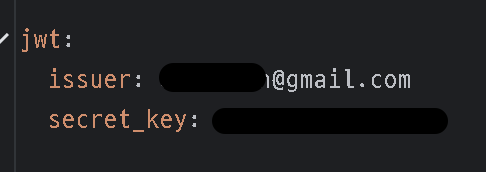

# ⏸️ 들어가기 앞서
전 글 :
블로그 - [JWT + Spring Security + OAuth2.0 (1)](https://velog.io/@tkdgml82/JWT-Spring-Security-OAuth2.0-1-5atjok39)
깃 - [JWT + Spring Security + OAuth2.0 (1)](https://github.com/tkdgml822/Obsidian_Study/blob/main/JWT%20%2B%20Spring%20Security%20%2B%20OAuth2.0/JWT%20%2B%20Spring%20Security%20%2B%20OAuth2.0%20(1).md)

코드를 설명하기 전에 제가 진행한 프로젝트는 `thyleaf` 및 `dto` 같은 것들은 설명하지 않겠습니다. 
JWT 및 OAuth에서 주요 코드 및 클래스들만 설명을 하는 형식으로 하겠습니다

## JwtProperties
```java
@Setter  
@Getter  
@Component  
@ConfigurationProperties("jwt") // 자바 클래스에 프로퍼티값을 가져와서 사용하는 애너테이션  
public class JwtProperties {  
    private String issuer;  
    private String secretKey;  
}
```
먼저 앞서 jwt에 Payload에는 7가 정도의 Regustered claims(미리 정의된 클레임)들이 있습니다.
- **iss (issuer) : 토큰 발급자**
- sub (subject) : 토큰 제목 - 토큰에서 사용자에 대한 식별 값이 됨
- aud (Audience) : 토큰 대상자
- exp (Expiration Time) : 토큰 만료 기간
- nbf (Not Before) : 토큰 활성 날짜 (이 날짜 이전의 토큰은 활성화되지 않음을 보장)
- iat (Issued At) 토큰 발급 시간
- jti (JWT id) : JWT 토큰 식별자 (issuer가 여러 명일 때 이를 구분하기 위한 값)  

이 `JwtProperties` 같은 경우는 `iss : 토큰 발급자`와 Signature에 

```java
HMACSHA256( 
	base64UrlEncode(header) + "." +
    base64UrlEncode(payload), 
    secret) // secret는 서버가 가지고 있는 키
```

secret를 담는 클래스입니다. 그럼 이 값은 어디서 올까요? 이 값들은 `application.yml`에서 옵니다.

오는 곳은 알았으니 어떻게 값들을 넣었을까요? 
- `@ConfigurationProperties("jwt")`: configuration 과 몇몇 속성을 .properties 혹은 .yaml 에서 쉽게 가져오는 방법을 제공
  예를 들어 application.yml 있다면
```yml
mail: 
 hostname: host@mail.com 
 port: 9000 
 from: mailer@mail.com
```

다음과 같이 사용하게 된다.
```java
@Configuration
@ConfigurationProperties(prefix = "mail")
public class ConfigProperties {
	private String hostName; 
	private int port; 
	private String from;
}
```

> 다른 방식도 있긴하다. 예를 들어 `@Value`를 사용하는 방식도 선택할 수 있을것이다.
> `@Value`은 `@ConfigurationProperties("mail")`와 비슷하지만 사용 방법이 다르다.
> `@ConfigurationProperties`같은 경우는 매핑을 자동으로 해주지만 `@Value`을 쓰면 필드에다가 하나씩 매핑을 해줘야 한다.
>  `@Value("#{mail.hostnName})` 이런씩으로 해준뒤 `ConfigProperties` 클래스 `hostName`에 붙여야 한다. `port`  매핑할려면 `@Value("#{mail.port}")`을 port에 붙여야 한다.

간단히 말하면 `@ConfigurationProperties`을 쓰면 `.yaml`에다가 쉽게 매핑이 된다.


## TokenProvider
클래스 이름대로 토큰을 제공해주는 클래스이다.
```java
@RequiredArgsConstructor  
@Service  
public class TokenProvider {  
  
    private final JwtProperties jwtProperties;  
  
    public String generateToken(User user, Duration expiredAt) {  
        Date now = new Date();  
        return makeToken(new Date(now.getTime() + expiredAt.toMillis()) , user);  
    }  
  
	// 1. JWT 토큰 생성 메서드  
    private String makeToken(Date expiry, User user) {  
        Date now = new Date();  
  
        return Jwts.builder()  
                .setHeaderParam(Header.TYPE, Header.JWT_TYPE)
				.setIssuer(jwtProperties.getIssuer())
                .setIssuedAt(now)
                .setExpiration(expiry) 
                .setSubject(user.getEmail())용자에 대한 식별 값  
                .claim("id", user.getId())이다.  
                .signWith(SignatureAlgorithm.HS256, jwtProperties.getSecretKey())  
                .compact();  
    }  
  
    // 2. JWT 토큰 유효성 검증 메서드  
    public boolean validToken(String token) {  
		try {  
            Jwts.parser()  
                    .setSigningKey(jwtProperties.getSecretKey())
                    .parseClaimsJws(token); 
                    
            return true;  
        } catch (Exception e) { // 복호화 과정에서 에러가 나면 유효하지 않은 토큰  
            return false;  
        }  
    }  
  
  
    // 3. 토큰 기반으로 인증 정보를 가져오는 메서드  
    public Authentication getAuthentication(String token) {  
        Claims claims = getClaims(token);  
        Set<SimpleGrantedAuthority> authorities = Collections.singleton(new SimpleGrantedAuthority("ROLE_USER"));  
  
        return new UsernamePasswordAuthenticationToken(new org.springframework.security.core.userdetails.User(  
                claims.getSubject(), "", authorities), token, authorities);  
  
    }  
  
    // 4. 토큰 기반으로 유저 ID를 가져오는 메서드  
    public Long getUserId(String token) {  
        Claims claims = getClaims(token);  
        return claims.get("id", Long.class);  
    }  
  
    private Claims getClaims(String token) {  
        return Jwts.parser() // 클레임 조회  
                .setSigningKey(jwtProperties.getSecretKey())  
                .parseClaimsJws(token)  
                .getBody();  
    }  
  
}
```

-  `generateToken()`
```java
public String generateToken(User user, Duration expiredAt) {  
    Date now = new Date();  
    return makeToken(new Date(now.getTime() + expiredAt.toMillis()) , user);  
}
```
`Date now = new Date();` :   Date를 써서 현재 시간을 가져온다.
`return makeToken(new Date(now.getTime() + expiredAt.toMillis()) , user);`: makeToken은 토큰을 만들어주는 메서드이다. 메서드에 현재 날짜와 Duration클래스를 사용해서 밀리초를 넣어준다. 그리고 마지막에는 user의 정보를 넣어준다. user 클래스는 추후 설명하겠다.


참고
[스프링의 @ConfigurationProperites 의 정확한 사용법, properties 읽어오기](https://blog.yevgnenll.me/posts/spring-configuration-properties-fetch-application-properties)
