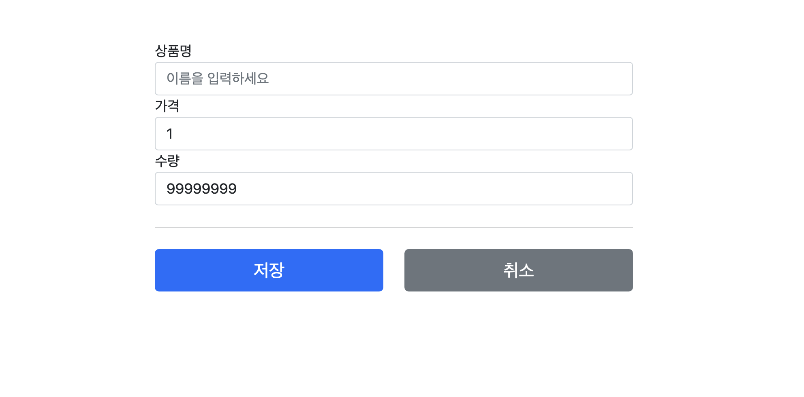

사용자가 상품명, 가격, 수량을 잘못 적는 일이 있다면 개발자들은 검증 처리를 해줘야 한다.
```java
@PostMapping("/add")  
public String addItem(@ModelAttribute Item item, RedirectAttributes redirectAttributes, Model model) {  
    // 검증 오류 결과를 보관  
    Map<String, String> errors = new HashMap<>();  
  
    // 검증 로직  
    if (!StringUtils.hasText(item.getItemName())) {  
        errors.put("itemName", "상품 이름은 필수입니다.");  
    }  
    if (item.getPrice() == null || item.getPrice() < 1000 || item.getPrice() > 1000000) {  
        errors.put("price", "가격은 1,000 ~ 1,000,000 까지 허용합니다.");  
    }  
    if (item.getQuantity() == null || item.getQuantity() >= 9999) {  
        errors.put("quantity", "수량은 최대 9,999 까지 허용합니다.");  
    }  
  
    // 특정 필드가 아닌 복합 룰 검증  
    if (item.getPrice() != null && item.getQuantity() != null) {  
        int resultPrice = item.getPrice() * item.getQuantity();  
        if (resultPrice < 10000) {  
            errors.put("globalError", "가격 * 수량은 10,000원 이상이어야 합니다." + resultPrice);  
        }  
    }  
  
    // 검증에 실패하면 다시 입력 폼으로  
    // errors.isEmpty()은 null일때 true을 반환 즉, 값이(error) 있으면 이 조건문 실행    
    if (!errors.isEmpty()) {  
        log.info("errors = {}", errors);  
        model.addAttribute("errors", errors);  
        return "validation/v1/addForm";  
    }  
  
    // 성공 로직  
    Item savedItem = itemRepository.save(item);  
    redirectAttributes.addAttribute("itemId", savedItem.getId());  
    redirectAttributes.addAttribute("status", true);  
    return "redirect:/validation/v1/items/{itemId}";
}
```
## `요구사항`
입력 폼이 비어있으면 안된다.
가격이 천원 이하거나 백만원 이상이면 안된다.
수량은 최대 9,999개 이어야 한다.
`가격 X 수량`은 만원 이상이어야 한다.

만약에 이 요구 사항이 틀리면 map에다가 오류 코드(key)와 오류 내용(value)을 넣어준다.
그런 다음에 다시 addForm(상품 입력 창)에다가. 보내 버린다. 

## 궁금한점
그런데 여기서 궁금한점이 생겼다. 사용자 입력한 데이터가 그대로 유지가 되는거다. 왜 그런걸까?

## 궁금점 해결
일단 강의를 들으면서 라이브 코딩으로 따라치고 있었는데 이건에 관한 내용은 강사님께서 얘기해줘서 궁금점이 해결되었다. 결론은 바로 `@ModelAttribute`때문이다.
```java
@PostMapping("/add")  
public String addItem(@ModelAttribute Item item, RedirectAttributes redirectAttributes, Model model {
	// .... 코드 생략 ....
}
```
`@ModelAttribute` 이제 Item 모델을 자동으로 모델(Model)에다가 담아주는 역할을 한다.
`@ModelAttribute`은 `model.addAttribute("item", item)`을 대신 해주는 거다.
이제 오류 검증 쪽 코드를 보면
```java
if (....) {
	return "validation/v1/addForm";
}
```
이런씩으로 넘어간다. 그러면 `@ModelAttribute`에 있던 모델 덕분에 `addForm.html`에 있는 thymeleaf에 `th:object${item}`이 모델 값을 받아주기 때문에 값들이 유지가 되는 것이었다.


`addForm.html`
```html
<form action="item.html" th:action th:object="${item}" method="post">  
    <div>        
	    <label for="itemName" th:text="#{label.item.itemName}">상품명</label>  
        <input type="text" id="itemName" th:field="*{itemName}" class="form-control" placeholder="이름을 입력하세요">  
    </div>    
    <div>        
	    <label for="price" th:text="#{label.item.price}">가격</label>  
        <input type="text" id="price" th:field="*{price}" class="form-control" placeholder="가격을 입력하세요">  
    </div>
    
	<div>
		<label for="quantity" th:text="#{label.item.quantity}">수량</label>  
        <input type="text" id="quantity" th:field="*{quantity}" class="form-control" placeholder="수량을 입력하세요">  
    </div>  
    
    <hr class="my-4">  
  
    <div class="row">  
        <div class="col">  
            <button class="w-100 btn btn-primary btn-lg" type="submit" th:text="#{button.save}">상품 등록</button>  
        </div>
        
		<div class="col">  
            <button class="w-100 btn btn-secondary btn-lg"  
                    onclick="location.href='items.html'"  
                    th:onclick="|location.href='@{/validation/v1/items}'|"  
                    type="button" th:text="#{button.cancel}">취소</button>  
        </div> 
        
   </div>
```