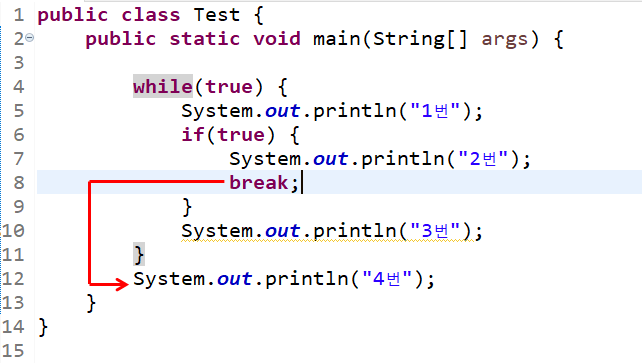
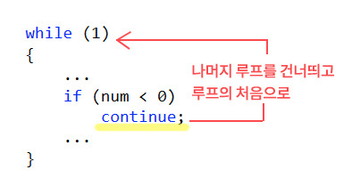

## if 그리고 else

- if문과 ~ else문
    
    ```java
    if (true or false) {
    	// 조건 true 시 실행되는 영역
    }
    else {
    	// 조건 false 시 실행되는 영역
    }
    ```
    
    if문과 else절에 속한 문장이 하나인 경우에는 중괄호 생략이 가능하다.
    
    ```java
    if (true or false)
    	// 조건 true 시 실행되는 영역
    else
    	// 조건 false 시 실행되는 영역
    ```
    
- if ~ else if ~ else 문
    
    여러 문장 중에서 조건에 따라 하나의 문장만 실행하고 싶다면 다음과 같은 구조의 문장을 구성하면 된다.
    
    ```java
    if(...)
    	System.out.println("...");
    else if(...)
    	System.out.println("...");
    else if(...)
    	System.out.println("...");
    else if(...)
    	System.out.println("...");
    else
    	System.out.println("...");
    ```
    
- if ~ else if ~ else 문은 if ~ else문을 중첩 시킨 결과이다.
    
    ```java
    if (num < 0) {
    	System.out.println("...");
    }
    else {
    	if (num < 100) {
    		System.out.println("...");
    	}
    	else {
    		System.out.println("...");
    	}
    }
    ```
    
- if ~ else 문과 유사한 성격의 조건 연산자
    
    ```java
    public class Main {
        public static void main(String[] args) {
            int num1 = 50;
            int num2 = 100;
            int big;
            int diff;
    
            big = (num1 > num2) ? num1 : num2;
            System.out.println("큰 수 : " + big);
    
            diff = (num1 > num2) ? (num1 - num2) : (num2 - num1);
            System.out.println("절 대 값: " + diff);
        }
    }
    ```
    
    `조건` ? `수1` : `수2`
    
    true일때 수1이 반환 false일때는 수2가 반환
    

## switch와 break

- switch문의 기본 구성
    
    ```java
    switch(n) {
    case 1: // n이 1이면 여기서부터 실행
    	...
    case 2: // n2 2이면 여기서부터 실행
    	...
    default: // 해당하는 case 없으면 여기서부터 실행 
    	...
    }
    ```
    
    n이 1이면
    
    default 포함 해서 실행한다.
    
- switch문의 들여쓰기
    
    case문과 default를 조금이라도 잘 보이도록 들여쓰기 대상에서 제외하는 것이 일반적이다.
    
- switch문 + break문 : switch문의 일반적인 사용 모델
    
    자바의 키워드 중에 break문이 있다. 그리고 이 break문을 switch문 안에 사용하면 다음의 의미를 갖는다.
    
    “switch문 밖으로 빠져나가겠습니다.”
    
    따라서 적절하게 사용하면된다.
    
    ```java
    switch(n) {
    case 1: // n이 1이면 여기서부터 실행
    	...
    	break;
    case 2: // n2 2이면 여기서부터 실행
    	...
    	break;
    default: // 해당하는 case 없으면 여기서부터 실행 
    	...
    }
    ```
    
    이런 경우는 default를 포함해서 실행시키지 않는다.
    
    그리고 둘 이상의 레이블을 이어서 둘 수도 있다.
    
    ```java
    switch(n) {
    case 1: 
    case 2:
    case 3:
    	System.out.println("Hi");
    	break;
    default: // 해당하는 case 없으면 여기서부터 실행 
    	...
    }
    ```
    
    이런 경우는 n이 1, 2, 3인 경우 전부
    
    ```java
    System.out.println("Hi");
    ```
    
    을 실행한다.
    

## for, while 그리고 do ~ while

- 반복문1 : while문
    
    ```java
    // 반복 조건
    while (num < 5) {
    	// 반복 영역
    	System.out.println("I like Java" + num);
    	num++;
    }
    ```
    
    - 먼저 조건 검사
    - 그리고 결과가 true이면 중괄호 영역 실행
- 반복문2: do ~ while문
    
    - 먼저 중괄호 영역 실행
    - 그리고 조건 검사 후 결과가 true이면 반복 결정
    
    while문은 ‘선 검사’ 방식이고 do ~ while문은 ‘후 검사’ 방식이다.
    
    ```java
    do {
    	System.out.println("I like Java" + num);
    	num++;
    } while (num < 5);
    ```
    
    “조건에 따른 반복이 필요하다. 그런데 반드시 한 번은 실행을 해야 한다.”
    
- 반복문2: for문
    
    ```java
    for (int num = 0; num < 5; num++) {
    	System.out.pritnln("...");
    }
    ```
    
    ```java
    int num = 0;
    while (num < 5) {
    	System.out.pritnln("...");
    	num++;
    }
    ```
    
    서로 같다.
    

## break & continue

break와 continue는 실행 흐름의 조절을 목적으로 반복문 내에 삽입되는 키워드이다. 따라서 이 둘을 적절히 사용하면 다양한 흐름을 보이는 반복문을 구성할 수 있다.

- break문
    
    switch문을 빠져나가는 용도 및 반복문을 빠져나갈때 쓰이기도 한다.
    
- continue문
    
    continue문은 실행하던 반복문의 나머지 부분을 생략하고 나머지 부분을 생략하고 프로그램의 흐름을 조건 검사 부분으로 이동시킨다. 즉 이 둘의 차이점은 다음과 같다.
    
    break문
    
    
    
    continue문
    
    
    
    
    윗 그림에서 보듯이 continue문을 만나면, 반복문의 나머지 부분을 실행하지 않고 반복문의 맨위로 이동을 하여 조건 검사부터 실행을 이어 나간다.
    
- 무한 루프와 break
    
    반복의 조건이 true로 명시되어서 해당 반복문을 빠져나가지 못하도록 구성된 반복문을 가리켜 ‘무한 루프’라 한다.
    
    ```java
    while (true) {
    	...
    }
    ```
    
    다음과 같이도 구성 할 수 있다.
    
    ```java
    do {
    	...
    } while(true)
    ```
    
    그리고 유사하게 for문도 반복의 조건을 명시하는 중간 부분에 true를 삽입하면 무한 루프가 생성된다. 그러나 다음과 같이 이 부분을 그냥 비워도 무한 루프가 형성된다.
    
    ```java
    for ( ; ; ) {
    	...
    }
    ```
    
    무한 루프는 언제 사용되나면 예를 들어
    
    ```java
    int num = 1;
    
    while (true) {
    	if (((num % 6) == 0) && ((num % 14) == 0))
    		break;
    	num++;
    	}
    	System.out.println(num);
    }
    
    ```
    
    이런 경우는 “6의 배수이면서 14의 배수인 자연수를 찾을 때까지 이 반복을 계속하겠다”라는 뜻이다.
    

## 반복문의 중첩

- 많이 등장하는 for문의 중첩
    
    활용도가 높고 이해하기 쉬운것이 for문의 중첩이다. 가장 쉬운 예는 구구단이다.
    
- while문의 중첩
    
    다양한 상황에서의 유여한 코드 작성을 위해 while문의 중첩도 보고자 한다.
    
    for문보다 복잡하기 때문에 반복문을 중첩할때는 for문을 우선으로 고려하기 바란다.
    
- 중첩된 반복문을 한 번에 빠져나오는 방법: 레이블을 설정하는 break문
    
    break문이 실행되면 자신을 감싸고 있는 하나의 중첩문만 빠져나오기 때문에 for문 전체를 빠져나오지는 못한다. 따라서 다음과 같은 상황에 문제가 될 수 도 있다.
    
    “구구단에서 곱의 결과가 72인 결과를 딱 하나만 보여라”
    
    ```java
    public class Main {
        public static void main(String[] args) {
            for (int i = 1; i < 10; i++) {
                for (int j = 1; j < 10; j++) {
                    if (i * j == 72) {
                        System.out.println(i + " x " + j + " = " + i * j);
                        break;
                    }
                }
            }
        }
    }
    ```
    
    ```
    8 x 9 = 72
    9 x 8 = 72
    ```
    
    결과 값이 72일때 break문을 실행한다. 하지만 탈출하는 것은 안쪽 break문이다.
    
    그렇다면 바깥쪽 for문까지 탈출할려고 하면 어떻게 해야 할까? 다음 예제에서 보이듯이 레이블을 이용하여 빠져나갈 위치를 명시해 주면 된다.
    
    ```java
    public class Main {
        public static void main(String[] args) {
            outer: for (int i = 1; i < 10; i++) {
                        for (int j = 1; j < 10; j++) {
                            if (i * j == 72) {
                                System.out.println(i + " x " + j + " = " + i * j);
                                break outer;
                            }
                        }
            }
        }
    }
    ```