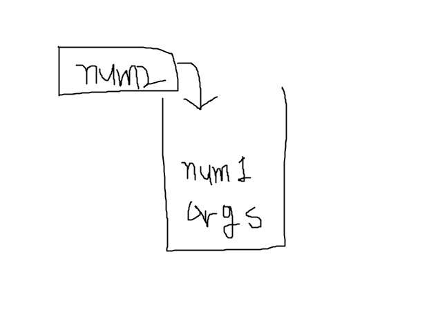
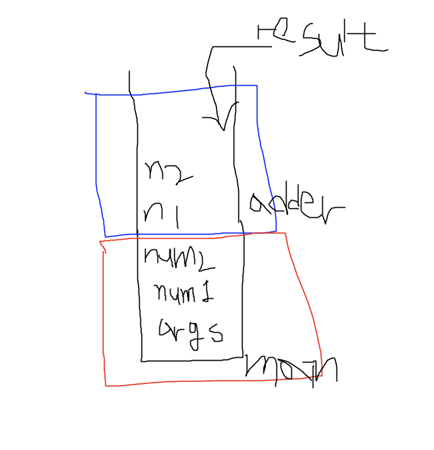
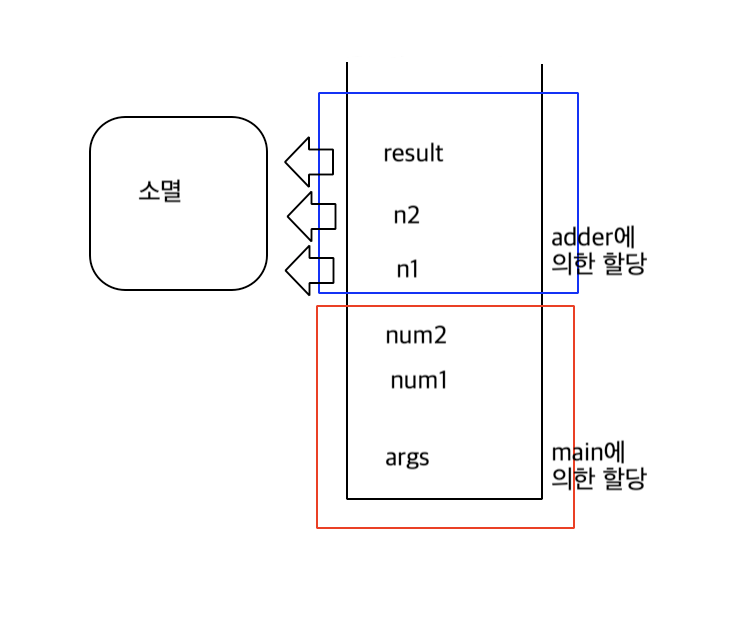
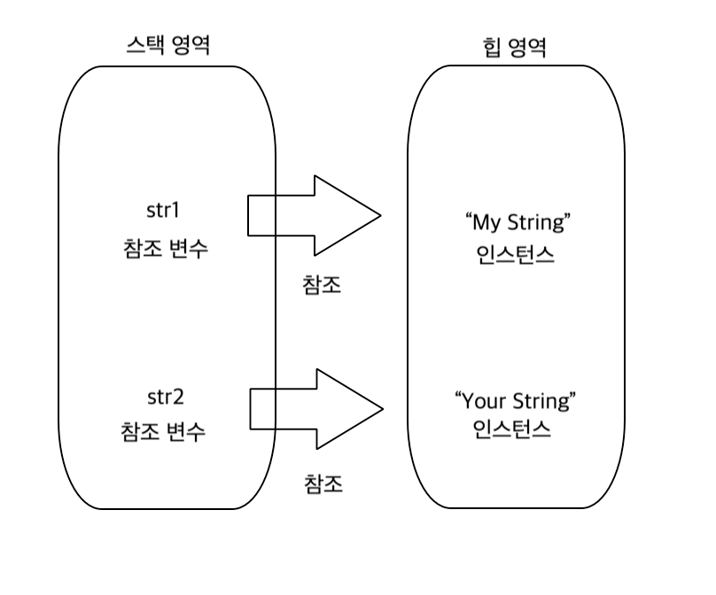

## 자바 가상머신의 메모리 모델

- 가상머신은 운영체제의 위에서 동작한다는 사실을 잊지 않으셨지요?
    
    - 자바 가상머신은 운영체제의 위에서 실행되는 하나의 프로그램이다.
    - 그리고 자바 프로그램은 자바 가상머신 위에서 실행되는 프로그램이다.
    
    그렇다면 가상머신은 운영체제 위에서 어떻게 제공되는 것일까? 프로그램의 실행에 필요한 메모리 공간을 가리켜 ‘메인 메모리(Main Memory)’라 하며, 이는 물리적으로 램(RAM)을 의미한다. 그리고 이 메모리의 효율적인 사용을 위해서 원도우, 리눅스와 같은 운영체제가 메모리를 관리한다. 즉 운영체제가 응용 프로그램의 메모리를 할당해 주는 것이다. 따라서 운영체제와 응용프로그램 사이에는 다음의 대화가 오고 간다는 가정할 수 있다.
    
    - 응용프로그램 A - 메모리를 할당해 주세요
        
    - 운영체제 - 네 4G 바이트를 할당해 드리겠습니다.
        
    - 응용프로그램 Z - 저도 메모리를 할당해 주세요
        
    - 운영체제 - 네 4G 바이트를 할당해 드리겠습니다.
        
    - 자바 가상머신 - 전 좀 특별합니다. 메모리를 좀 특별하게 할당해 주세요.
        
    - 운영체제 - 제 눈에는 특별하지 않습니다. 마찬가지로 4G 바이트를 할당해 드리겠습니다.
        
    
    위의 대화에서 보이듯이, 자바 가상머신은 운영체제가 할당해 주는 메모리 공간을 기반으로 스스로를 실행하면서 더불어 자바 응용 프로그램의 실행도 돕는다.
    
- 자바 가상머신의 메모리 살림살이
    
    가상머신은 운영체체로부터 받은 메모리 용량을 효율적인 사용을 고민해야 한다. 그렇다면 메모리 공간의 사용방법은 무엇일까? 메모리는 저장공간이다. 서랍 처럼 저장공간을 분류해서 저장을 하면 쉽게 그리고 빨리 찾을 수 있다. 가상머신도 프로그램의 실행을 위해서 메모리 관리를 해야한다. 즉 수납장과 마찬가지로 메모리 공간을 나누고 데이터를 특성에 따라 구분해서 저장해야 한다. 가상머신이 메모리 공간을 어떻게 나누는지 살펴보자.
    
    [https://t1.daumcdn.net/cfile/tistory/9907BA445A61C58833](https://t1.daumcdn.net/cfile/tistory/9907BA445A61C58833)
    
    위 그림에서 보이듯이 가상머신은 메모리 공간을 크게 세 개의 영역으로 나눈다. 그리고 각각의 메모리 영역에는 다음의 데이터들을 저장한다.
    
    - 메소드 영역 (Method Area) - 메소드의 바이트코드, static 변수
    - 스택 영역 (Stack Area) - 지역변수, 매개변수
    - 힙 영역 (Heap Area) - 인스턴스
- 메소드 영역
    
    소스파일을 컴파일할 때 생성되는, 자바 가상머신에 의해 실행이 가능한 코드를 가리켜 ‘바이트코드’라 한다. 그리고 이 바이트코드도 메모리 공간에 존재해야 실행이 가능하다. 이와 관련하여 다음 코드를 보자.
    
    ```java
    class Boy {
    	static int average = 0;
    	public void Run() {....}
    }
    class MyMain {
    	public static void main(String[] args) {
    		Boy b = new Boy(); // 인스턴스 생성
    		Boy.average += 5;  // 클래스 변수 접근
    		....
    	}
    }
    ```
    
    위의 main 메소드에서는 Boy 인스턴스를 생성하고 또 Boy의 클래스 변수에 접근하고 있다. 이렇듯 인스턴스의 생성 및 클래스 변수의 접근을 위해서는 먼저 해당 클래스의 바이트코드가 메모리 공간에 로딩되어야 하는데, 이때 로딩되는 메모리 공간이 ‘메소드 영역’이다.
    
- 스택 영역
    
    스택은 지역변수와 매개변수가 저장되는 공간이다. 그런데 이 둘의 다음의 공통점이 있다.
    
    “중괄호로 구분되는 지역 내에서만 유효한 변수들이다.”
    
    즉 중괄호 내에 할당된 이후에 해당 중괄호를 벗어나면 바로 소멸되는 특성의 데이터 저장을 위한 영역이 ‘스택’이다. 이러한 스택의 메모리 관리 방식에 대한 이해를 돕기 위해서 다음 코드 보자.
    
    ```java
    public static void main(String[] args) {
    	int num1 = 10;
    	int num1 = 20; <- 현재 실행 위치
    	adder(num1, num20);
    	System.out.println("end of Program");
    }
    
    public static void adder(int n1, int n2) {
    	int result = n1 + n2;
    	return result;
    } 
    ```
    
    
    
    위 그림은 main 메소드가 호출되고 나서 변수 num1과 num2가 스택에 할당된 상황을 보여준다. 위의 코드를 실행하면 다음의 순서로 변수가 선언된다.
    
    args → num1 → num2
    
    그래서 맨 아래에서의 args, num1, num2의 순으로 쌓였다. 이어서 adder 메소드가 호출된 이후의 상황은 다음과 같다.
    
    ```java
    public static void main(String[] args) {
    	int num1 = 10;
    	int num1 = 20; 
    	adder(num1, num20); <- 메소드가 호출되고
    	System.out.println("end of Program");
    }
    
    public static void adder(int n1, int n2) {
    	int result = n1 + n2; <- 현재 실행 위치
    	return result;
    } 
    ```
    
    
    
    adder 메소드가 호출되면서 매개변수 n1과 n2가 스택에 할당되었고, 이어서 변수 result 할당되었다. 참고로 main 메소드는 아직 종료되지 않은 상태이기 때문에 main 메소드에서 선언된 변수들도 스택에 함께 쌓여있다. 그럼 이제 변수 result에 저장되어 있는 값을 반환하면서 메소드를 빠져나간 이후에 상황을 관찰하자.
    
    ```java
    public static void main(String[] args) {
    	int num1 = 10;
    	int num1 = 20; 
    	adder(num1, num20); <- 메소드는 반환되고
    	System.out.println("end of Program"); <- 현재 실행 위치
    }
    
    public static void adder(int n1, int n2) {
    	int result = n1 + n2; <- 현재 실행 위치
    	return result;
    } 
    ```
    
    
    
    메소드 adder를 빠져나오자 그 안에서 할당된 지역변수와 매개변수가 스택에서 전부 소멸되었다. 이렇듯 지역변수와 매개변수는 선언되는 순간에 스택에 할당되었다가 자신이 할당된 영역을 벗어나면 소멸이 된다.
    
- 힙 영역
    
    인스턴스는 힙 영역에 할당된다. 그렇다면 인스턴스를 스택이 아닌 힙이라는 별도의 영역에 할당하는 이유는 무엇일까? 그것은 인스턴스 소멸 시점과 소멸 방법이 지역변수와 다르기 때문이다. 앞서 데이터의 성격이 다르면, 메모리 공간을 구분해서 관리해야 함을 서랍장에 비유해서 설명하지 않았는가?
    
    ```java
    public static void simpleMethod() {
    	String str1 = new String("My String");
    	String str2 = new String("Your String);
    	....
    }
    ```
    
    String 인스턴스의 생성문이 메소드 내에 존재하므로 str1과 str2는 참조변수이자 지역변수이다. 따라서 이 둘은 스택에 할당된다. 그러나 인스턴스는 무조건 힙에 할당되니 메모리 공간에는 다음의 관계가 형성된다.
    
    
    
    그렇다면 이렇게 힙에 생성된 인스턴스들은 언제 소멸될까? 인스턴스의 소멸시기를 결정하는 것은 가상머신의 역할이다. 즉 가상머신이 다음과 같이 판단을 하면 인스턴스는 자동으로 소멸된다.
    
    “이제 이 인스턴스는 소멸시켜야 되겠군”
    
    그래서 자바는 다른 프로그래밍 언어에 비해 ‘메모리 관리에 신경을 덜 써도 된다.”는 평가를 받는다. 하지만 이것을 메모리 관리가 어떻게 되는지 몰라도 된다는 의미는 아니다. 메모리 관리는 가상머신이 하지만 가상머신의 메모리 관리 방식을 어느 정도는 알고 있어야 좋은 코드를 작성할 수 있다.
    
- 자바 가상머신의 인스턴스 소멸시기
    
    자바 가상머신은 합리적으로 인스턴스의 소멸시기를 결정한다. 이에 대한 이해를 위해서 다음 코드를 보자.
    
    ```java
    public static void simpleMethod() {
    	String str1 = new String("My String");
    	String str2 = new String("Your String");
    	...
    	str1 = null; // 참조 관계 소멸
    	str2 = null; // 참조 관계 소멸
    	...
    }
    ```
    
    위의 코드에서는 str1과 str2에 Null을 대입하였다. 이로써 str1과 str2가 참조했던 두 String 인스턴스는 어느 참조변수도 참조하지 않은 상태가 되었다.
    
    
    
    이와 같은 상태가 되면 인스턴스는 존재할 이유가 없다. 더 이상 접근할 수 없는 인스턴스이기 때문이다. 때문에 이러한 상태의(아무런 참조변수도 참조하지 않은 상태의) 인스턴스는 ‘소멸의 대상’이 되어 가상머신에 의해 소멸이 이뤄진다.
    
    지금까지 설명한 자바의 인스턴스 소멸 방식을 가리켜 ‘가비지 컬렉션’이라 하며, 이는 프로그래밍의 편의를 돕는 자바의 매우 특별한 기능이다. 정리하면, 힙 영역은 가상머신에 의한 가비지 컬렉션이 일오나는 메모리 공간이다.
    
    - 가비지 컬렉션이 발생하는 시점
        
        인스턴스가 가비지 컬렉션의 대상이 되었다고 바로 소멸되지는 않는다. 가비지 컬렉션의 빈번한 실행은 시스템에 부담이기 때문에 성능에 영향을 미치지 않도록 가비지 컬렉션의 실행 타이밍은 별도의 알고리즘 기반으로 계산되며, 이 계산 결과를 가비지 컬렉션이 수행된다.
        

## Object 클래스

- 인스턴스 소멸 시 해야 할 일이 있다면: finalize 메소드
    
    Object 클래스에는 다음 메소드가 정리되어 있다. 이는 아무도 참조하지 않은 인스턴스가 가비지 컬렉션에 의해 소멸되기 전에 자동으로 호출되는 메소드이다.
    
    ```java
    protected void finalize() throws Throwable
    ```
    
    따라서 인스턴스 소멸 시 반드시 실행해야 하는 코드가 있다면 이 메소드의 오버라이딩을 고려할 수 있다.
    
    ```java
    class Person {
        String name;
    
        public Person(String name) {
            this.name = name;
        }
    
        @Override
        protected void finalize() throws Throwable {
            super.finalize(); // 상위 클래스의 finalize 메소드 호출
            System.out.println("destroyed: " + name);
        }
    }
     
    class ObjectFinalize { 
        public static void main(String[] args) {
            Person p1 = new Person("Yoon");
            Person p2 = new Person("Park");
            
            p1 = null; // 참조 대상을 가비지 컬레션의 대상으로 만듬
            p2 = null; // 참조 대상을 가비지 컬레션의 대상으로 만듬
    
            // System.gc();
            // System.runFinalization();
                
            System.out.println("end of program");
        }
    }
    ```
    
    예제에서 정의된 finalize 메소드는 다음과 같다 .
    
    ```java
    @Override
    protected void finalize() throws Throwable {
      super.finalize(); // 상위 클래스의 finalize 메소드 호출
      System.out.println("destroyed: " + name);
    }
    ```
    
    이렇듯 상위 클래스의 메소드를 오버라이딩 하는 경우, 오버라이딩 된 상위 클래스의 메소드를 호출하는 것에는 다음의 의미가 있다.
    
    “상위 클래스 finalize 메소드에 삽입되어 있느 코드들이 실행되도록 하자.” 사실 Object 클래스의 finalize 메소드는 하는 일이 아무것도 없다. 따라서 위의 상황에서는 상위 클래스의 finalize 메소드 호출이 무의미하다. 그러나 예제의 Person 클래스 다른 클래스를 상속한다면 상황은 달라진다. 정리하면, 오버라이딩 하는 상위 클래스의 메소드가 본인이 정의한 클래스가 아니라면, 특히 Object같이 자바에서 제공하는 클래스의 메소드라면 이렇듯 오버라이딩 된 메소드를 호출하는 것이 안전하다. 다시 본론으로 돌아와서, 실행 결과를 보면 두 인스턴스를 가비지 컬렉션의 대상이 되게 하였음에도 불구하고 finalize 메소드가 호출된 흔적은 볼 수가 없는데 그 이유는 다음과 같다.
    
    - 가비지 컬렉션은 빈번히 일어나지 않는다.
    - 소멸한 인스턴스가 생겨도 가비지 컬렉션으로 바로 이어지지 않는다.
    
    게다가 실행 중인 자바 프로그램이 종료가 되면 프로그램을 위해 할당된 메모리 전부가 통째로 해제되기 때문에 이렇듯 finalize 메소드의 호출이 생략될 가능성도 있다. 이러한 상황에서 System 클래스에 정의된 다음 두 메소드의 순차적 호출을 통해서 finalize 메소드의 호출을 어느 정도는 보장받을 수 있다.
    
    ```java
    public static void gc()
    -> 가비지 컬렉션의 수행을 요청(명령이 아닌 요청)
    ```
    
    ```java
    public static void runFinalization()
    -> 소멸이 보류된 인스턴스의 finalize 메소드 호출을 요청(명령이 아닌 호출)
    ```
    
    위의 첫번째 메소드를 통해 가비지 컬렉션의 수행을 요청할 수 있다. 그러나 요청이 있었다고하여 언제나 가비지 컬렉션을 바로 진행하지는 않는다. 다만 가비지 컬렉션을 진행하도록 가상머신이 노력을 할 뿐이다. 그리고 가비지 컬렉션이 수행된다고 해도 소멸 대상을 그 순간 모두 소멸하지는 않는다. 시스템의 상황에 따라서 일부 인스턴스의 완전한 소멸은 보류될 수도 있다. 따라서 필요하다면 위의 두 번째 메소드 호출을 통해서 보류된 인스턴스의 소멸까지 요청을 해야 한다. 그러나 이 역시 요청일 뿐이므로 가상머신에게 독촉하는 수준으로 메소드의 기능을 이해해야 한다.
    
    - 가비지 컬렉션을 강제로 진행하지 말자
        
        가상머신은 매우 합리적인 방법으로 가비지 컬렉션을 수행한다. 따라서 특별한 상황이 아니면 가비지 컬렉션 동작에 영향을 미치는 호출을 삼가하는 것이 좋다.
        
- 인스턴스의 비교 : eauals 메소드
    
    이전에 언급 했듯이 == 연산자는 참조변수의 참조 값을 비교한다. 따라서 서로 다른 두 인스턴스의 내용을 비교할려면 별도의 방법을 사용해야 한다. 이와 관련하여 다음 예제를 보자.
    
    ```java
    class INum {
        private int num;
        
        public INum(int num) {
            this.num = num;
        }
        
        @Override
        public boolean equals(Object obj) {
            if(this.num == ((INum)obj).num)
                return true;
            else
                return false;
        }
    }
    
    class ObjectEquality {
        public static void main(String[] args) {
            INum num1 = new INum(10);
            INum num2 = new INum(12);
            INum num3 = new INum(10);
            
            if(num1.equals(num2))
                System.out.println("num1, num2 내용 동일하다.");
            else
                System.out.println("num1, num2 내용 다르다.");
    
            if(num1.equals(num3))
                System.out.println("num1, num3 내용 동일하다.");
            else
                System.out.println("num1, num3 내용 다르다.");
        }
    }
    ```
    
    위 예제의 INum 클래스는 Object 클래스의 equals 메소드를 다음과 같이 오버리이딩 하였다. 클래스 내에 선언된 인스턴스 변수의 내용을 비교하여 그 결과에 따라 true 또는 false를 반환하도록 오버라이딩 하였다.
    
    ```java
    @Override
    public boolean equlas(Object obj) {
    	if (this.num == ((INum)obj).num) {
    		return true;
    	}
    	else {
    		return false;
    	}
    }
    ```
    
    이렇듯 두 인스턴스의 내용 비교 결과인 true, false의 반환 조건은 해당 클래스를 정의하는 프로그램모가 결정해야 한다. 그리고 그 결정 상황을 equals 메소드의 오버라이딩을 통해서 반영해야 한다. Object 클래스의 equals 메소드는 == 연산자와 마찬가지로 참조변수의 참조 값을 비교하도록 정의되어 있다. 그런데 == 연산을 총해서 참조 값 비교는 가능하다. 때문에 equals 메소드의 호출을 통해 참조 값을 비교할 필요는 없다. 즉 equals 메소드는 내용 비교가 이뤄지도록 오버라이딩 하라고 존재하는 메소드이다. 자바에서 제공하는 표준 클래스의 경우 equals 메소드가 내용 비교를 하도록 이미 오버라이딩 되어 있는 경우가 많다. 대표적인 예가 String 클래스인데 이와 관련하여 다음 예제를 보자.
    
    ```java
    class StringEquality {
        public static void main(String[] args) {
            String str1 = new String("So Simple");
            String str2 = new String("So Simple");
    
            // 참조 대상을 비교하는 if ~ else문 
            if(str1 == str2)
                System.out.println("str1, str2 참조 대상 동일하다.");
            else
                System.out.println("str1, str2 참조 대상 다르다.");
    
            // 두 인스턴스 내용 비교하는 if ~ else문
            if(str1.equals(str2))
                System.out.println("str1, str2 내용 동일하다.");
            else
                System.out.println("str1, str2 내용 다르다.");
        }
    }
    ```
    
    ```
    str1, str2 참조 대상 다르다.
    str1, str2 참조 대상 동일하다.
    ```
    
    두 인스턴스의 내용 비교를 원한다면 Object 클래스의 equals 메소드를 오버라이딩 하자. 자바 개발자들은 인스턴스의 내용 비교가 필요한 상황에서 equals 메소드가 적절히 오버라이딩 되어 있을 것을 기대한다. 그리고 단순히 참조변수의 값을 비교하려면 == 연산을 하자.
    
- 인스턴스 복사(복제): clone 메소드
    
    Object 클래스에서 인스턴스를 복사를 위한 다음 메소드가 정의되어 있다.
    
    ```java
    protected Object clone() throw CloneNotSupportedException
    ```
    
    이 메소드가 호출되면, 호출된 메소드가 속한 인스턴스의 복사본이 생성되고, 이렇게 만들어진 복사본의 참고 값이 반환된다. 단, 다음 인터페이스를 구현한 인스턴스를 대상으로만 위의 메소드를 호출할 수 있다.
    
    ```java
    interface Cloneable
    -> 이 인터페이스를 구현한 클래스의 인스턴스만 clone 메소드 호출 가능
    ```
    
    만약에 Cloneable 인터페이스를 구현하지 않은 클래스의 인스턴스를 대상으로 clone 메소드를 호출하면 CloneNotSupportedException 예외가 발생한다. 그렇다면 Cloneable 인터페이스의 구현에는 어떠한 의미가 있을까?
    
    “이 클래스의 인스턴스는 복사해도 됩니다. 즉 clone 메소드 호출이 가능합니다.”
    
    사실 Cloneable 인터페이스는 ‘마커 인터페이스’다. 즉 정의해야 할 메소드가 존재하지 않는, 복사를 해도 된다는 표식의 인터페이스이다. 바꾸어 말하면 clone 메소드의 호출이 허용된다는 표식일 뿐이다.
    
    인스턴스의 복사는 클래스에 따라 허용해서는 안되는 작업이 될 수 있다. 따라서 인스턴스 복사의 허용 여부는 클래스를 정의하는 과정에서 고민하고 결정해야 한다. 그리고 복사를 허용해도 된다는 결론이 나오면 Cloneable 인터페이스를 구현해서 clone 메소드의 호출이 가능하도록 하면 된다. 그럼 지금까지 설명한 내용과 관련해서 다음 예제를 보자.
    
    ```java
    class Point implements Cloneable {
        private int xPos;
        private int yPos;
        
        public Point(int x, int y) {
            xPos = x;
            yPos =y;
        }
        
        public void showPosition() {
            System.out.printf("[%d, %d]", xPos, yPos);
            System.out.println();
        }
        
        @Override
        public Object clone() throws CloneNotSupportedException {
            return super.clone();
        }
    }
    
    class InstanceCloning {
        public static void main(String[] args) {
            Point org = new Point(3, 5);
            Point cpy;
            
            try {
                cpy = (Point)org.clone();
                org.showPosition();
                cpy.showPosition();
            }
            catch(CloneNotSupportedException e) {
                e.printStackTrace();
            }
        }
    }
    ```
    
    ```java
    [3, 5]
    [3, 5]
    ```
    
    위 예제의 코드를 보면 다음과 같이 오버라이딩 하였다.
    
    ```java
    @Override
    public Object clone() throws CloneNotSupportedException {
      return super.clone();
    }
    ```
    
    내용을 보면 상위 클래스, 즉 Object 클래스의 clone 메소드를 호출한 것이 전부이다. 따라서 오버라이딩이 무의미해 보일 수 도있다.
    
    그러나 중요한 차이가 있다. 앞서 보였지만 Object 클래스의 clone 메소드는 다음과 같이 정의되어 있다.
    
    ```java
    protected Object clone() throws CloneNotSupportedException
    ```
    
    즉 protected로 선언되어 있던 clone 메소드를 오버라이딩 하여 public으로 바꿔주었다. 그리고 이것이 오버라이딩을 한 이유이다. 이렇듯 메소드 오버라이딩을 통해서 접근 범위를 넓히는 것이 가능하다. 예를 들어서 protected로 선언된 메소드를 오버라이딩을 통해서 public으로 변경하는 것은 불가능하다. 즉 public으로 메소드를 protected로 바꿀 수는 없다.
    
    ```java
    class Point implements Cloneable {
        private int xPos;
        private int yPos;
        
        public Point(int x, int y) {
            xPos = x;
            yPos = y;
        }
        
        public void showPosition() {
            System.out.printf("[%d, %d]", xPos, yPos);
            System.out.println();
        }
    
        public void changePos(int x, int y) {
            xPos = x;
            yPos = y;
        }
        
        @Override
        public Object clone() throws CloneNotSupportedException {
            return super.clone();
        }
    }
    
    class Rectangle implements Cloneable {
        private Point upperLeft;     // 좌측 상단 좌표
        private Point lowerRight;     // 우측 하단 좌표
        
        public Rectangle(int x1, int y1, int x2, int y2) {
            upperLeft = new Point(x1, y1);
            lowerRight = new Point(x2, y2);
        }
    
        // 좌표 정보를 수정함
        public void changePos(int x1, int y1, int x2, int y2) {
            upperLeft.changePos(x1, y1);
            lowerRight.changePos(x2, y2);
        }
        
        @Override
        public Object clone() throws CloneNotSupportedException {
            return super.clone();
        }
    
        // 직사각형 좌표 정보 출력    
        public void showPosition() {
            System.out.print("좌측 상단: ");
            upperLeft.showPosition();
            
            System.out.print("우측 하단: ");
            lowerRight.showPosition();
            System.out.println(); 
        }
    }
    
    class ShallowCopy {
        public static void main(String[] args) {
            Rectangle org = new Rectangle(1, 1, 9, 9);
            Rectangle cpy;
            
            try {
                // 인스턴스 복사
                cpy = (Rectangle)org.clone();
    
                // 한 인스턴스의 좌표 정보를 수정
                org.changePos(2, 2, 7, 7);
    
                org.showPosition();
                cpy.showPosition();
            }
            catch(CloneNotSupportedException e) {
                e.printStackTrace();
    	        }
        }
    }
    ```
    
    ```
    좌측 상단: [2, 2]
    우측 하단: [7, 7]
    
    좌측 상단: [2, 2]
    우측 하단: [7, 7]
    ```
    
    위 예제에서 다음과 같이 인스턴스를 복사 한 후에 참조변수 org가 참조하는 인스턴스의 값을 수정하였다.
    
    ```java
    public static void main(String[] args) {
      Rectangle org = new Rectangle(1, 1, 9, 9);
      Rectangle cpy;
        
      try {
    			// 인스턴스 복사
    		  cpy = (Rectangle)org.clone();
    		
    		  // 한 인스턴스의 좌표 정보를 수정
    	    org.changePos(2, 2, 7, 7);
    ```
    
    따라서 두 인스턴스에 저장된 값이 다를 것으로 예상할 수 있다. 그런데 실행 결과는 이러한 예상이 잘못되었음을 알려준다. 일단 org가 참조하는 인스턴스를 대상으로 clone 메소드를 호출하였고, 그 결과 인스턴스의 복사는 제대로 이뤄졌다.
    
    그런데 Rectangle 인스턴스의 멤버는 다음과 같이 두 개의 참조변수로 이뤄져 있다.
    
    ```java
    class Rectangle implements Cloneable {
    	private Point upperLeft;
    	private Point lowerRight;
    	...
    }
    ```
    
    따라서 복사 과정에서 참조변수가 지니는 참조 값이 그대로 새 인스턴스에 복사가 된다. 결국 clone의 호출로 만들어진 원본과 복사복의 관계는 값은 참조 값(주소 값)을 가르켜 생기는 문제이다. 이를 우리는 ‘얕은 복사’라고 한다.
    
    우리가 원하는 결과는 org와 cpy가 각각의 각자의 값을 갖는 것을 원할 것이다. 이를 ‘깊은 복사’라고 한다. 그렇다면 위의 형태의 복사가 이뤄지도록 다음과 clone 메소드를 오버라이딩 해야 한다.
    
    ```java
    @Override
    public Object clone() throws CloneNotSupportedException [
    	//Object 클래스의 clone 메소드 호출을 통한 복사본 생성
    	Rectangle copy = (Rectangle)super.clone();
    
    	// 깊은 복사의 형태로 복사본을 완성
    	copy.upperLeft = (Point)upperLeft.clone();
    	copy.lowerRight = (Point)lowerRight.clone();
    	
    	// 완성된 복사본의 참조 값 반환
    	return copy;
    }
    ```
    
- 인스턴스 변수가 String인 경우의 깊은 복사
    
    다음과 같은 인스턴스가 있다.
    
    ```java
    class Person implements Cloneable [
    	private String name;
    	private int age;
    	
    	public Person(String name, int age) {
    		this.name = name;
    		this.age = age;
    	}
    	....
    }
    ```
    
    그럼 다음과 같은 형태로 깊은 복사 이뤄진다.
    
    ```java
    @Override
    public Object clone() throws CloneNotSupportedException {
    	Person cpy = (Person)super.clone(); // clone 메소드 호출을 통한 복사본 생성
    	cpy.name = new String(name); // 깊은 복사의 형태로 복사본을 완성
    	return cpy; // 완성된 복사본의 참조 값 반환
    }
    ```
    
    그런데 String 클래스가 Cloneable 인터페이스를 구현하지 않는 이유는 무엇일까? 그 이유는 매우 간단한다. 그리고 합리적이다.
    
    “String은 문자열의 수정이 불가능하므로, 깊은 복사의 대상에서 제외해도 된다.”
    
    String 인스턴스의 내용을 이루는 문자열은 인스턴스 생성 시 결정이 되고, 이렇게 한번 결정이 되면 변경이 불가능하다. 따라서 서로 다른 인스턴스가 하나의 String 인스턴스를 공유해도 문제가 되지 않는다. 즉 위의 clone 메소드는 다음과 같이 오버라이딩 하는 것이 합리적이다.
    
    ```java
    @Override
    public Object clone() throws CloneNotSupportedException {
    	return super.clone();
    } // Person 클래스의 합리적인 clone 오버라이딩
    ```
    
    - 배열의 clone 메소드 호출
        
        배열도 인스턴스이다. 그리고 clone 메소드의 호출이 가능하도록 public으로 오버라이딩 되어있다. 그러나 깊은 복사 진행되도록 오버라이딩 되어 있지는 않다. 따라서 배열이 지니는 참조 값의 복사만 이뤄질 뿐 해당 참조 값의 인스턴스까지는 복사되지 않는다.
        
    
    궁금한점 알아보기
    
    오버라이딩을 할 때, 접근 제한자가 같아야 하는 것이 일반적인 규칙이긴 하지만, 그 보다 중요한 원칙은 '하위 클래스에서 오버라이딩하는 메서드의 접근 범위가 상위 클래스의 메서드보다 축소되지 않아야 한다'는 것입니다.
    
    즉, 자바에서는 protected로 선언된 메서드를 public으로 오버라이딩하는 것이 가능합니다. 이렇게 하면, 기본적으로 같은 패키지 내의 클래스나 하위 클래스에서만 접근이 가능한 protected 메서드를, 모든 클래스에서 접근 가능한 public 메서드로 변경하는 것이 가능해집니다.
    
    clone() 메서드의 경우, Object 클래스에 protected로 선언되어 있습니다. 하지만 우리가 원하는 객체를 복제하는 경우, 대부분의 경우에는 다른 클래스에서도 접근이 가능하도록 public으로 오버라이딩을 하게 됩니다.
    
    그래서 Cloneable 인터페이스를 구현하는 클래스에서는 clone() 메서드를 public으로 오버라이딩하게 되는데, 이는 접근 범위를 확장하는 것이므로 문제가 되지 않습니다.
    
- clone 메소드의 반환형 수정 : Convariant Return Type
    
    ```java
    ....
    @Override
    public Object clone() throws CloneNotSupportedException [
    	reuturn super.clone();
    }
    ```
    
    아까 윗 코드에서 Point 클래스를 정의하였다. 그리고 그 코드로 clone 반환형을 수정하는 법을 알아보겠다.
    
    ```java
    Point org = new Point(1, 2);
    Point cpy = (Point)org.clone(); // 형 변환해야 함
    ```
    
    자바 5이후부터는 오버라이딩 과정에서 반환형의 수정을 허용한다. 예를 들어서 다음 클래스의 method를 오버라이딩 할 때,
    
    ```java
    class AAA {
    	public AAA method() {...} // 반환형이 자신이 속한 AAA 클래스 형이다.
    }
    ```
    
    다음과 같이 반환형을 수정할 수 있다.
    
    ```java
    class ZZZ extends AAA {
    	@Override
    	public ZZZ method() {...} // 반환형이 자신이 속한 ZZZ 클래스 형이다.
    }
    ```
    
    단 무엇이든 수정할 수 있는 것은 아니다. 위에서 보이는 바와 같이 클래스의 이름이 AAA인 경우 반환형이 AAA인 메소드에 대해서만 반환형을 수정해서 오버라이딩 할 수 있다. 그리고 오버라이딩을 할 때에도 하위 클래스의 이름이 ZZZ인 경우 반환형은 ZZZ로만 수정할 수 있다. 따라서 이러한 문법적 특성을 고려하여 Point 클래스의 clone 메소드는 다음과 같이 오버라이딩 할 수 있다.
    
    ```java
    class Point implements Cloneable {
    	....
    	@Override
    	public Point clone() throws CloneNotSupportedException {
    		return (Point)(super.clone());
    	}
    }
    ```
    
    그리고 이런씩으로 오버라이딩이 하면, 다음과 같이 형 변환 없는 clone 메소드의 호출이 가능하다.
    
    ```java
    Point org = new Point(1, 2);
    Point cpy = org.clone(); // 형 변환 필요 없음
    ```